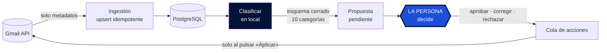
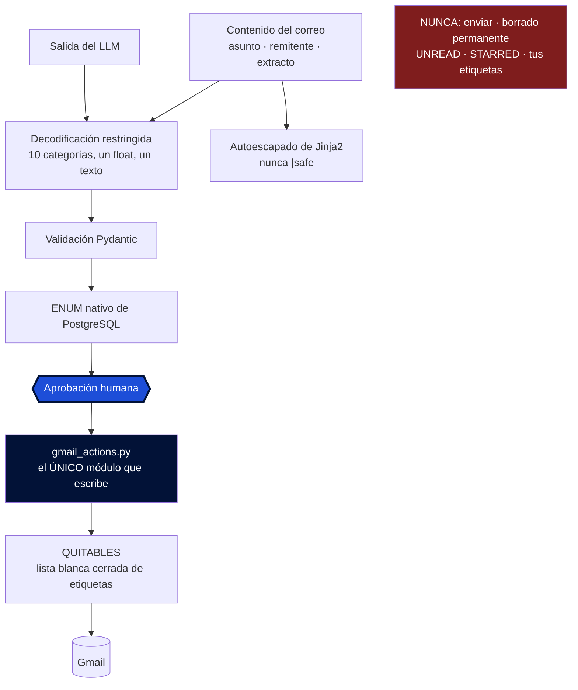

<p align="center">
  <picture>
    <source srcset="src/mailpilot/static/logo-oscuro.png" media="(prefers-color-scheme: dark)">
    
  </picture>
</p>

<p align="center">
  <a href="https://github.com/abrilespinosa/mailpilot/actions/workflows/tests.yml">
    
  </a>
  
  
  
</p>

<p align="center">
  <a href="README.md">English</a> · <b>Español</b>
</p>

---

# MailPilot

Capa de gestión inteligente sobre Gmail: clasifica el correo con IA que corre **en local**
y propone qué hacer con cada mensaje, sin ejecutar nada por su cuenta.

Proyecto personal de aprendizaje sobre arquitectura backend, sistemas de datos, IA
aplicada y seguridad.

---

## El principio, y no es negociable

> **La IA propone. La persona decide. MailPilot ejecuta solo lo autorizado.**

- El LLM **nunca** ejecuta acciones sobre Gmail. Toda acción pasa por: propuesta →
  validación → **aprobación humana explícita** → ejecución → registro de auditoría.
- El contenido de los correos **nunca sale de la máquina**. Todo el procesamiento es
  local, con [Ollama](https://ollama.com). Ninguna API de IA externa, ninguna de pago.
- La única acción destructiva es **mover a papelera**, reversible 30 días. El borrado
  permanente exige un scope de OAuth que no se pide, así que no depende de nuestra
  disciplina: no es que esté prohibido, es que no se puede.
- **MailPilot no puede enviar correo.** Esta garantía sí depende del código, porque
  `gmail.modify` lo permitiría. La sostienen un enum cerrado de tres acciones, un único
  módulo autorizado a escribir, y un test que rastrea el código fuente buscando `.send(`.

---

## Stack

| | |
|---|---|
| **Lenguaje** | Python 3.14 |
| **API + dashboard** | FastAPI · Jinja2 — renderizado en servidor, sin framework JS |
| **Base de datos** | PostgreSQL 17 · SQLAlchemy 2 · Alembic |
| **IA** | Ollama · qwen3:8b · scikit-learn (clasificador propio) |
| **Infra** | Docker Compose · GitHub Actions |
| **Tests** | pytest · 224 tests contra PostgreSQL de verdad |

---

## Cómo funciona



**Se leen solo metadatos** (`format=metadata`): asunto, remitente, extracto, fecha y
etiquetas. El cuerpo no se descarga, y lo que no se descarga no se puede filtrar.

**La persistencia es idempotente**: `INSERT ... ON CONFLICT` sobre el id de Gmail.
Reingerir mil veces deja las mismas filas.

**Decidir y ejecutar son pasos distintos.** Las acciones aprobadas se encolan y solo
cambian Gmail al pulsar «Aplicar». Ese paso intermedio es lo que hace revisable una acción
destructiva: se ve qué está a punto de pasar antes de que pase.

---

## Dónde vive de verdad la seguridad



**No existe ningún campo por el que el modelo pueda pedir una acción.** Devuelve una de
diez categorías, un número entre 0 y 1 y un texto de explicación — y esa explicación se le
enseña a la persona pero nunca se interpreta como instrucción.

La defensa contra prompt injection es arquitectónica, no detección de frases: la
generación se restringe a un esquema JSON **durante el muestreo de tokens** (no es una
petición amable en el prompt), lo que no valide se descarta, el ENUM de PostgreSQL es la
última barrera aunque alguien escriba saltándose la aplicación, y la plantilla autoescapa,
así que un correo con `<script>` se lee pero no se ejecuta.

Y hay tests que comprueban que algo **no existe**: que ningún módulo puede enviar correo,
que solo uno escribe en Gmail, que la lista de etiquetas quitables es cerrada, que el
servidor nunca abre el navegador. Se ejecutan en cada push.

---

## Probarlo en un minuto, sin cuenta de Gmail


```bash
python scripts/seed_demo.py
DATABASE_URL="$(grep -m1 '^DATABASE_URL' .env | cut -d= -f2-)_demo" uvicorn mailpilot.api:app
```

Diez correos inventados, sin credenciales ni modelos que descargar. Escribe en
`<tu_base>_demo`, así que no puede tocar correo real.

Mira la primera tarjeta. El razonamiento del modelo es impecable —*una confirmación con
fecha, hora y enlace para gestionarla*— y aun así su respuesta es falsa, con **0,95 de
confianza**. **Dos propuestas están mal a propósito**, porque una demo donde la IA acierta
siempre no enseña para qué existe el paso humano. Un correo lleva `<script>` en el asunto,
para ver funcionar el escapado.

---

## Lo que costó llegar a un número honesto

Ocho versiones de prompt y varios conjuntos de correos etiquetados a mano. Lo que enseña
esta parte no es el porcentaje final, sino cuántas formas hay de medirse mal:

| Prompt | Conjunto | Acierto | |
|---|---|---|---|
| v2 | dev | 87,5 % | ⚠️ inflado: afinado sobre esos mismos correos |
| v4 | test | 92,5 % | ⚠️ inflado: el prompt se escribió viendo sus fallos |
| **v4** | **test2** | **73,8 %** | **primera medición honesta** |
| **v7** | **test6** | **82,5 %** | **honesta, etiquetada a ciegas** |

**El 92,5 % era un espejismo de 18,7 puntos.** Afinar mirando los fallos del mismo
conjunto con el que mides infla el resultado, y solo un conjunto que nadie ha tocado lo
revela.

### Tres cosas que enseñó medir bien

**Una palabra ambigua costaba 16 puntos.** La definición de `promociones` decía «ofertas
no solicitadas», y en español *oferta* significa descuento **y** vacante de empleo, así que
los avisos de portales de trabajo caían en publicidad. Corregirlo llevó `trabajo` de 3/16
a 16/16. No era un fallo del modelo: era ambigüedad de la especificación.

**Enseñar la respuesta del modelo antes de preguntar cambia la respuesta.** Los mismos 160
correos, partidos por la mitad, mismo prompt, mismo día:

| | a ciegas | viendo la propuesta |
|---|---|---|
| acierto global | 82,1 % | 85,0 % |
| acierto en la categoría ambigua | 65,4 % | 87,5 % |

El efecto se concentra justo donde la decisión es dudosa: aprobar es un clic y llevarle la
contraria cuesta. Por eso el dashboard tiene modo ciego, y por eso **es el que viene por
defecto**: de los dos defectos posibles, solo uno falla de forma segura. Olvidarte del
modo ciego te quita una ayuda; olvidarte de activarlo te corrompe los datos sin avisar.

**La confianza del LLM no sirve como umbral.** Medido con dos modelos y siete prompts, la
diferencia de confianza entre aciertos y fallos nunca pasó de +0,07. Pedirle al modelo que
se calibrara la empeoró. Consecuencia de diseño: nada se aprueba solo por confianza alta.

### El estancamiento no era del prompt, era de las categorías

`otros` fue la peor categoría en las cuatro mediciones honestas. Significaba dos cosas a la
vez —«boletín al que me suscribí» y «el modelo no sabe»— y **ninguna versión de prompt
arregla una definición ambigua**: solo mueve errores de sitio.

Así que el arreglo no fue otro prompt. **Las categorías estaban definidas por tema, y los
temas no tienen bordes.** Siete pasaron a diez, y cada una se define ahora por una pregunta
con respuesta comprobable:

| | La pregunta que decide |
|---|---|
| `personal` | ¿lo ha escrito una persona, para mí? |
| `seguridad` | ¿va de acceder a una cuenta mía? |
| `tramites` | ¿tiene consecuencias si no lo atiendo? |
| `compras` | ¿es de algo que ya compré? |
| `empleo` | ¿va de conseguir trabajo? |
| `boletines` | ¿me suscribí yo a esto? |
| `social` | ¿es actividad de una red social? |
| `avisos` | ¿un servicio que uso me notifica algo operativo? |
| `promociones` | ¿me quiere vender algo **ahora**? |
| `otros` | solo «no encaja en ninguna» |

Un tema se lee de diez maneras; un hecho no. Y `otros` dejó de ser un cajón para
convertirse en una **métrica de salud**: como solo significa «no encaja», que suba del 5 %
avisa de que falta una categoría. En 758 correos etiquetados ha salido **cero veces**.

---

## Después entrené mi propio clasificador

Con las categorías arregladas, los errores dejaron de venir en grupos: eran siete
confusiones distintas, ninguna repetida. Un grupo se caza con una regla; los errores
dispersos significan que el criterio es correcto y la entrada es demasiado pobre. Además el
LLM se relee las diez definiciones cada vez que llega correo de `goodreads.com`, mientras
que un modelo entrenado aprende ese dominio una vez.

Así que entrené uno: **TF-IDF + regresión logística** con mis propias etiquetas, medido
contra qwen3 sobre los mismos correos.

El modelo son veinte líneas de scikit-learn. La medición es la parte que merece leerse:

- **Solo etiquetas decididas a ciegas.** Ver la propuesta del modelo empuja a darle la
  razón, así que una etiqueta anclada enseñaría al modelo nuevo a copiar los sesgos del
  viejo.
- **371 etiquetas anteriores se tiraron**, porque nada registraba cuáles estaban ancladas.
  La base de datos tiene ahora una columna `decidido_a_ciegas` para que eso no se pierda
  nunca más.
- **La partición está congelada en un archivo** y el script se niega a regenerarla:
  rehacerla movería correos entre las dos mitades e invalidaría en silencio todo lo medido
  antes.

| | Acierto | Tiempo por correo |
|---|---|---|
| Contestar siempre la categoría más común | 20,9 % | — |
| **Modelo entrenado** | **73,6 %** | **0,001 s** |
| qwen3:8b | 72,5 % | 6,3 s |

Un empate (McNemar, z = 0,00) y **6.000 veces más rápido**. Y conviene decirlo claro: el
82 % citado más arriba nunca fue comparable con esto, porque venía de la taxonomía vieja
de siete categorías sobre otros correos.

### Lo interesante: fallan en correos distintos

El modelo entrenado gana donde decide **el remitente**: `promociones` saca 0,89 de F1 con
16 ejemplos, porque «stradivarius» y «fnac» bastan. qwen3 gana donde hay que **entender**
el correo — `personal` («¿hay una persona detrás?») y `tramites` («¿tiene consecuencias si
no lo atiendo?»).

Solo 9 de 91 correos se les resisten a los dos. Algo que eligiera siempre al que acierta
llegaría al **90,1 %** frente al 73,6 % del mejor por separado. Es un argumento medido para
una arquitectura híbrida, no una corazonada — y es lo que construyó el
[ADR 008](docs/decisions/008-el-arbitro-cede-por-categoria.md).

---

## El resultado del que más aprendí: los números se movieron muchísimo

Tres conjuntos de prueba distintos, cada uno etiquetado a ciegas y mirado una sola vez:

| Conjunto | Modelo entrenado | qwen3:8b |
|---|---|---|
| generación 1 (91) | 73,6 % | 72,5 % |
| generación 2 (199) | **60,3 %** | **54,3 %** |
| generación 3 (196) | **76,5 %** | 58,7 % |

Un modelo que oscila entre el 60 % y el 76 % según a quién le preguntes no se interpreta
solo. **Lo que hace legibles esos números es tener a qwen3 al lado**: no aprende nada, es
la misma función con el mismo prompt, así que cuando marca 72,5 y luego 54,3 lo que ha
cambiado no es el instrumento, son los correos.

Eso permitió repartir el salto de la generación 3 en tres partes: **+2,4** por una mezcla
de categorías más favorable, **+5,7** porque el correo es más fácil (lo mide qwen3, que no
puede mejorar) y **~+8,1** de mejora real del modelo.

Un modelo fijo midiendo junto a uno que aprende es lo único que distingue «he empeorado»
de «el examen es más difícil». Es la pieza de metodología que más me ha servido.

**Un detalle que tuve del revés durante dos sesiones**: el etiquetado camina hacia atrás en
el tiempo, así que el conjunto de prueba es **más antiguo** que el de entrenamiento, no más
reciente. Eso significa que estos números miden generalización hacia atrás, no rendimiento
futuro — y para medir lo segundo hay que reservar correo que todavía no ha llegado.

*Registro completo del experimento, con dos hipótesis que resultaron falsas:*
[`entrenamiento/README.md`](entrenamiento/README.md).

---

## Estado

- [x] **Fase 1-4** — Gmail API + OAuth · ingestión idempotente · modelo de datos · API
- [x] **Fase 5-6** — Clasificación local con Ollama · evaluación con conjuntos a ciegas
- [x] **Fase 7-8** — Propuestas y decisiones · dashboard en modo ciego por defecto
- [x] **Fase 9** — Acciones reales: etiquetar, archivar, papelera, recuperar
- [x] **Fase 10-11** — Diez categorías con pregunta comprobable · carga en segundo plano
- [x] **Fase 12** — Clasificador propio entrenado, medido contra el LLM
- [x] **Árbitro** entre los dos modelos: cede por categoría, no por confianza
- [ ] **Siguiente** — auto-aprobar el tercio de bandeja de confianza alta (98,6 % de
      acierto medido sobre correo no visto) · observabilidad · Docker completo

---

## Puesta en marcha

**Requisitos:** Docker, Python 3.14, [Ollama](https://ollama.com) y credenciales OAuth de
la Gmail API.

```bash
python -m venv venv && source venv/bin/activate
pip install -e ".[dev]"       # editable: sin reinstalar al editar

cp .env.example .env          # y rellenar

docker compose up -d          # PostgreSQL
alembic upgrade head          # crear el esquema
ollama pull qwen3:8b
```

Las credenciales de Google (`credentials/client_secret.json`) se descargan de Google Cloud
Console. La carpeta está excluida del repositorio.

### Uso

```bash
python scripts/test_auth.py            # verificar OAuth
python scripts/ingest.py --limit 80    # Gmail -> PostgreSQL
python scripts/classify.py             # clasificar
python scripts/propose.py              # generar propuestas

uvicorn mailpilot.api:app --reload
```

- `http://localhost:8000/` — **el dashboard**, en modo ciego. Diez chips de categoría por
  correo, y la papelera como gesto aparte, porque «qué es esto» y «no lo quiero» son dos
  preguntas distintas. Con `?ciego=0` se ve la propuesta del modelo, a cambio de que esa
  tanda deje de valer como medición.
- `http://localhost:8000/docs` — documentación interactiva de la API, generada sola.

El dashboard **no tiene endpoints de escritura propios**: sirve HTML y sus botones llaman a
la misma API JSON que usaría cualquier otro cliente. Así las reglas viven en un único sitio
y la pantalla no es un camino privilegiado. Un test recorre sus rutas y exige que todas
sean `GET`.

### Tests

```bash
pytest                    # todo (necesita PostgreSQL levantado)
pytest -m "not db"        # solo los que no tocan la base de datos
```

PostgreSQL de verdad y no SQLite, a propósito: el esquema usa ENUM nativos y JSONB. Con
SQLite los tests pasarían y producción fallaría, que es lo peor que puede hacer un test.

---

## Estructura

```
src/mailpilot/
  auth.py           credenciales OAuth (único módulo que accede a credentials/)
  gmail.py          lectura de la Gmail API
  gmail_actions.py  el ÚNICO módulo que escribe en Gmail
  db.py             motor y sesiones
  models.py         cinco tablas + los enums cerrados
  schemas.py        esquemas de la API, separados de los modelos a propósito
  repository.py     persistencia, propuestas y decisiones
  classifier.py     clasificación con Ollama
  jobs.py           la tanda de fondo del botón de cargar correos
  api.py            FastAPI: la API JSON, único camino de escritura
  web.py            dashboard: solo rutas GET, solo sirve HTML
scripts/            herramientas manuales, incluido el entrenamiento del clasificador
entrenamiento/      registro del experimento (los datos no se versionan)
docs/decisions/     ADRs
```

**Los esquemas de la API están separados de los modelos de base de datos a propósito.** Así
añadir una columna a una tabla no la publica sola por HTTP: exponer un campo es una
decisión explícita, y un test fija el conjunto exacto de campos que devuelve el listado.

---

## Seguridad y privacidad

- El contenido de los correos **no sale de la máquina**, y **no se descarga el cuerpo**:
  solo asunto, remitente y extracto.
- Credenciales, `.env` y datos de evaluación excluidos del repositorio, con el historial
  auditado antes de hacerlo público.
- PostgreSQL escucha **solo en `127.0.0.1`**, y la API se arranca siempre en localhost.
- Los endpoints de escritura son una **lista blanca verificada por un test**: cualquier
  ruta de escritura nueva lo hace fallar hasta que se añada a conciencia. **No existe
  ningún endpoint `DELETE`.**
- Un token caducado devuelve un 503 con instrucciones en vez de colgar la petición: el
  servidor no puede entrar nunca en el flujo interactivo del navegador.

---

## Decisiones de arquitectura

En [`docs/decisions/`](docs/decisions/), cada una con contexto, alternativas descartadas y
consecuencias.

- [**ADR 001** — Categorías de clasificación](docs/decisions/001-categorias-de-clasificacion.md)
  — por qué un enum cerrado. *Superado por el ADR 006.*
- [**ADR 002** — Tirar no es corregir](docs/decisions/002-tirar-no-es-corregir.md)
  — por qué «esto es promociones» y «esto lo tiro» son decisiones separadas. Mezclarlas
  habría subido el acierto medido 3,3 puntos borrando el 42 % de la muestra.
- [**ADR 003** — Subir el scope a `gmail.modify`](docs/decisions/003-scope-gmail-modify.md)
  — por qué el scope mínimo **es** la barrera, y qué garantía impone Google frente a cuál
  sostiene solo nuestro código.
- [**ADR 004** — Clasificar archiva](docs/decisions/004-clasificar-archiva.md)
  — quitar INBOX es lo que significa archivar en Gmail, y cómo la lista de etiquetas
  quitables se estrechó en vez de abrirse para permitirlo.
- [**ADR 005** — Paquete instalable](docs/decisions/005-paquete-instalable.md)
  — por qué `src` salió del path de pytest: dejarlo permitiría que los tests pasaran con
  una instalación rota.
- [**ADR 006** — Diez categorías](docs/decisions/006-diez-categorias.md)
  — definir cada categoría por una pregunta comprobable en vez de por un tema.
- [**ADR 007** — Entrenar un clasificador propio](docs/decisions/007-entrenar-un-clasificador-propio.md)
  — por qué otro prompt era el movimiento equivocado, y por qué 371 etiquetas se tiraron
  en vez de reutilizarse.
- [**ADR 008** — El árbitro cede por categoría](docs/decisions/008-el-arbitro-cede-por-categoria.md)
  — el umbral de confianza que parecía obvio, falló, y merecía quedar escrito igual.

---

## Licencia

MIT
