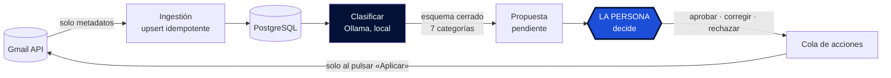

<p align="center">
  <picture>
    <source srcset="src/mailpilot/static/logo-oscuro.png" media="(prefers-color-scheme: dark)">
    
  </picture>
</p>

<p align="center">
  <a href="https://github.com/abrilespinosa/mailpilot/actions/workflows/tests.yml">
    
  </a>
  
  
  
</p>

<p align="center">
  <a href="README.md">English</a> · <b>Español</b>
</p>

---

# MailPilot

Capa de gestión inteligente sobre Gmail: clasifica el correo con un LLM que corre **en
local** y propone qué hacer con cada mensaje, sin ejecutar nada por su cuenta.

Proyecto personal de aprendizaje sobre arquitectura backend, sistemas de datos, IA
aplicada y seguridad.

---

## El principio, y no es negociable

> **La IA propone. La persona decide. MailPilot ejecuta solo lo autorizado.**

- El LLM **nunca** ejecuta acciones sobre Gmail.
- Toda acción pasa por: propuesta → validación → **aprobación humana explícita** →
  ejecución → registro de auditoría.
- El contenido de los correos **nunca sale de la máquina**. Todo el procesamiento de IA
  es local, con [Ollama](https://ollama.com). No se usa ninguna API de IA externa.
- La única acción destructiva es **mover a papelera**, reversible 30 días y deshacible
  desde el propio dashboard. El borrado permanente está fuera del alcance del proyecto,
  no solo del MVP: además el scope que se pide (`gmail.modify`) **no lo permitiría**, así
  que no depende de nuestra disciplina.
- **MailPilot no puede enviar correo.** Esa garantía sí depende del código, porque
  `gmail.modify` lo permitiría: la sostienen un enum cerrado de tres acciones, un único
  módulo autorizado a escribir, y un test que rastrea el código fuente.

---

## Stack

| | |
|---|---|
| **Lenguaje** | Python 3.14 |
| **API + dashboard** | FastAPI · Jinja2 — renderizado en servidor, sin framework JS |
| **Base de datos** | PostgreSQL 17 · SQLAlchemy 2 · Alembic |
| **IA local** | Ollama · qwen3:8b (Q4_K_M, 5,2 GB) |
| **Infra** | Docker Compose · GitHub Actions |
| **Tests** | pytest · 200 tests contra PostgreSQL de verdad |

**Coste cero.** Gmail API, modelos locales y herramientas de código abierto. Ninguna API
de IA de pago, nunca.

---

## Cómo funciona



1. **Ingestión** — se leen los mensajes con `format=metadata`: asunto, remitente,
   extracto, fecha y etiquetas. **El cuerpo de los correos no se descarga**, porque el
   modelo de datos no lo necesita. Lo que no se descarga no se puede filtrar.
2. **Persistencia** — `INSERT ... ON CONFLICT` sobre el id de Gmail. Reingerir mil veces
   deja las mismas filas.
3. **Clasificación** — un modelo local asigna una de diez categorías, con la generación
   restringida a un esquema cerrado.
4. **Propuesta** — cada clasificación genera una propuesta pendiente.
5. **Decisión** — se aprueba, se corrige o se rechaza. Lo que propuso el modelo se
   conserva intacto junto a lo que eligió la persona.
6. **Ejecución** — las acciones aprobadas se encolan y **solo cambian Gmail al pulsar
   «Aplicar»**. Ese paso intermedio es lo que hace revisable una acción destructiva: se
   puede ver qué está a punto de pasar antes de que pase.

---

## Dónde vive de verdad la seguridad

Fronteras de confianza, y qué módulo puede cruzarlas:


No existe ningún campo por el que el modelo pueda pedir una acción. Devuelve **una de
diez categorías, un número entre 0 y 1 y un texto de explicación** — y esa explicación
se le enseña a la persona pero **nunca se interpreta como instrucción**.

La defensa contra prompt injection es arquitectónica, no detección de frases:

| Barrera | Qué hace |
|---|---|
| **Decodificación restringida** | La generación se limita a un esquema JSON durante el muestreo de tokens. No es una petición amable en el prompt. |
| **Validación Pydantic** | Lo que no valide se descarta. Los campos que el modelo se invente se ignoran. |
| **ENUM nativo de PostgreSQL** | Última barrera, y se aplica aunque alguien escriba en la base de datos saltándose la aplicación. |
| **Autoescapado en la plantilla** | El asunto y la explicación se pintan como texto. Un correo con `<script>` se lee, no se ejecuta. |

Y un conjunto de tests que comprueban que algo **no existe**: que ningún módulo puede
enviar correo, que solo uno escribe en Gmail, que la lista de etiquetas quitables es
cerrada, que el servidor nunca abre el navegador. Se ejecutan en cada push.

---

## Probarlo en un minuto, sin cuenta de Gmail


Grabado sobre los datos de demostración de aquí abajo. La primera tarjeta es la que hay que
mirar. El razonamiento del modelo es impecable —*una confirmación con fecha, hora y enlace
para gestionarla*— y aun así su respuesta es falsa, con **0,95 de confianza**. Por eso aquí
nada se aprueba solo por superar un umbral, y por eso la vista de clasificados guarda la
respuesta del modelo junto a la tuya: cada desacuerdo es un correo bien etiquetado que sale
del uso normal, sin etiquetar nada a mano.

La barra de arriba dice *dos acciones esperando, todavía no ha cambiado nada en Gmail*.
Decidir y ejecutar son pasos distintos, y solo el segundo toca tu cuenta.

```bash
python scripts/seed_demo.py
DATABASE_URL="$(grep -m1 '^DATABASE_URL' .env | cut -d= -f2-)_demo" uvicorn mailpilot.api:app
```

Diez correos inventados. Sin credenciales, sin OAuth, sin descargar ningún modelo.

**Dos de las propuestas están mal a propósito** —una es una cita médica leída como
compra, que es un fallo real medido en este proyecto— porque una demo donde la IA acierta
siempre no enseña para qué existe el paso humano. Un correo lleva `<script>` en el asunto,
así se ve funcionar el escapado.

Escribe en `<tu_base>_demo`, derivada igual que los tests derivan `_test`, así que no
puede tocar correo real.

---

## Evaluación: lo que costó llegar al número real

El clasificador se mide contra conjuntos de correos etiquetados a mano.

| Prompt | Conjunto | Acierto | |
|---|---|---|---|
| v1 | dev | 50,0 % | punto de partida |
| v2 | dev | 87,5 % | ⚠️ inflado: afinado sobre esos mismos correos |
| v2 | test | 70,0 % | primer conjunto limpio |
| v4 | test | 92,5 % | ⚠️ inflado: el prompt se escribió viendo sus fallos |
| **v4** | **test2** | **73,8 %** | **medición honesta** |
| v5 | test2 | 76,2 % | tras corregir el fallo que test2 destapó |
| **v5** | **test3** | **82,1 %** | **honesta, etiquetada a ciegas** |
| **v7** | **test6** | **82,5 %** | **honesta, etiquetada a ciegas** |

**El 92,5 % era un espejismo de 18,7 puntos.** Afinar el prompt mirando los fallos del
mismo conjunto con el que se mide infla el resultado, y solo un conjunto que nadie ha
tocado lo revela.

### Cinco cosas que enseñó medir bien

**Una palabra ambigua costaba 16 puntos.** La definición de `promociones` decía «ofertas
no solicitadas». En español *oferta* significa descuento **y** vacante de empleo, así que
los avisos de portales de trabajo caían en publicidad. Corregirlo llevó `trabajo` de 3/16
a 16/16. No era un fallo del modelo: era ambigüedad de la especificación.

**El acierto global puede subir mientras se rompe lo importante.** Una versión del prompt
subió al 86,2 % y hundió la categoría `personal` a 0 de 5: los correos de personas reales
acabaron en el cajón de dudas. Sin mirar la matriz de confusión, ese cambio parecía un
éxito.

**Enseñar la respuesta del modelo antes de preguntar cambia la respuesta.** Los mismos 160
correos, partidos por la mitad, mismo prompt, mismo día. Una mitad etiquetada viendo la
propuesta y la otra a ciegas:

| | a ciegas | viendo la propuesta |
|---|---|---|
| acierto global | 82,1 % | 85,0 % |
| acierto en la categoría ambigua | 65,4 % | 87,5 % |
| correcciones hacia esa categoría | 9 de 78 | 3 de 80 |

El efecto se concentra justo donde la decisión es dudosa: aprobar es un clic y llevarle la
contraria cuesta. Por eso el dashboard tiene **modo ciego** — y por eso el modo ciego es
ahora **el que viene por defecto**. Antes había que pedirlo con un parámetro, y una tanda
entera de 80 correos se perdió porque teclear la URL a secas lo quitaba sin avisar. De los
dos defectos posibles, solo uno falla de forma segura: olvidarte del modo ciego te quita
una ayuda; olvidarte del parámetro te corrompe los datos sin ninguna señal.

**Por debajo de ~18 puntos, con lotes de 80 correos, estás leyendo ruido.** Distinguir un
82 % de un 87 % con confianza exige unos 250 correos por lado. Varias comparaciones de la
tabla estaban por debajo de ese umbral: azar, contado como mejora. El prompt v7 le gana al
v5 por 0,4 puntos, que son z = 0,07: nada.

**La confianza del modelo no sirve como umbral.** Medido con dos modelos y siete versiones
de prompt, la diferencia de confianza entre aciertos y fallos nunca superó +0,07, y a
veces fue +0,004. Pedirle al modelo que se calibrara la empeoró.

> **Consecuencia de diseño:** no se puede aprobar nada automáticamente por confianza alta.
> Toda propuesta pasa por una persona.

### El modelo con más aciertos no siempre es el mejor

| Modelo | Acierto | `personal` |
|---|---|---|
| qwen3:8b | 70,0 % | 3/5 |
| llama3.1:8b | **73,8 %** | **0/5** |

llama3.1 acierta más, pero **nunca predijo `personal`**: mandó los cinco al cajón de
dudas. Perder correos de personas reales pesa mucho más que confundir una promoción, así
que se eligió qwen3. El criterio no es el porcentaje, es cuánto cuesta cada tipo de error.

### Dónde se estancó, y qué lo arregló de verdad

`otros` era la peor categoría en las cuatro mediciones honestas. Significaba dos cosas a
la vez —«boletín al que me suscribí» y «el modelo no sabe»— y ninguna versión de prompt
arregla una definición ambigua: solo mueve errores de sitio, que es exactamente lo que
llevaba pasando desde el v3.

Así que el arreglo no fue otro prompt. **Se redefinieron las categorías.**

El disparador fueron dos síntomas que resultaron ser el mismo problema: dudaba al
etiquetar correo normal, y el modelo llevaba cuatro versiones de prompt clavado en el
82 %. Mis propias 738 etiquetas dijeron dónde: `avisos` era el 31 % de todo y tenía
dentro tres cosas que no se parecen, y `trabajo` no iba de trabajo — 75 de sus 80 correos
eran de portales de empleo.

**Las categorías estaban definidas por tema, y los temas no tienen bordes.** Siete pasaron
a diez, y cada una se define ahora por **una pregunta con respuesta comprobable** en vez
de por un asunto:

| | La pregunta que decide |
|---|---|
| `personal` | ¿lo ha escrito una persona, para mí? |
| `seguridad` | ¿va de acceder a una cuenta mía? |
| `tramites` | ¿tiene consecuencias si no lo atiendo? |
| `compras` | ¿es de algo que ya compré? |
| `empleo` | ¿va de conseguir trabajo? |
| `boletines` | ¿me suscribí yo a esto? |
| `social` | ¿es actividad de una red social? |
| `avisos` | ¿un servicio que uso me notifica algo operativo? |
| `promociones` | ¿me quiere vender algo **ahora**? |
| `otros` | solo «no encaja en ninguna» |

Un tema se lee de diez maneras; un hecho no. Y `otros` dejó de ser un cajón para
convertirse en una **métrica de salud**: como ahora solo significa «no encaja», que suba
del 5 % es la señal de que falta una categoría. Sobre 450 correos etiquetados a mano
salió **cero**.

---

## Después entrené mi propio clasificador

Con las categorías arregladas, los errores cambiaron de forma. Dejaron de venir en grupos.

Y eso importa, porque un grupo de errores se caza con una regla — un arreglo del prompt
llevó `trabajo` de 7/13 a 13/13. Pero después de la redefinición, los fallos que quedaban
eran **siete confusiones distintas, ninguna repetida**. No quedaba regla que escribir: el
criterio era correcto y lo que faltaba era información. El modelo ve un remitente, un
asunto y una vista previa de ~180 caracteres — vacía en 146 de los 2.498 correos.

Además desperdicia la señal más fuerte que hay. Cada vez que llega correo de
`goodreads.com`, el LLM se relee las diez definiciones y razona desde cero. Un modelo
entrenado aprende ese dominio una vez.

Así que entrené uno: **TF-IDF + regresión logística**, con mis propias 450 etiquetas, y lo
medí contra qwen3 **sobre los mismos correos de prueba**.

### El montaje

Lo honesto de esto no es el modelo —son veinte líneas de scikit-learn—, es la medición.

- **Solo etiquetas decididas a ciegas.** Ver la respuesta del modelo antes de decidir
  empuja a darle la razón, así que una etiqueta anclada le enseñaría al modelo nuevo a
  copiar los sesgos del viejo.
- **Las 371 etiquetas que ya tenía se tiraron.** Mezclaban decisiones ancladas con la
  taxonomía vieja de siete categorías, y nada registraba cuál era cuál. Por eso la base de
  datos tiene ahora una columna `decidido_a_ciegas`, y por eso se reetiquetaron 450
  correos desde cero contra **propuestas en blanco**, sin ninguna opinión del modelo a la
  vista.
- **359 de entrenamiento / 91 de prueba**, estratificado y con la partición congelada en
  un archivo. El script se niega a regenerarla: rehacerla movería correos de un lado a
  otro e invalidaría en silencio cualquier medida anterior.

### El resultado

| | Acierto | Tiempo por correo |
|---|---|---|
| Contestar siempre la categoría más frecuente | 20,9 % | — |
| **Modelo entrenado** | **73,6 %** | **0,001 s** |
| **qwen3:8b, prompt v8** | **72,5 %** | **6,3 s** |

Empate — McNemar sobre los 31 correos en que discrepan da z = 0,00. Veinte líneas de
scikit-learn, entrenadas en menos de un segundo, igualan a un LLM de 8.000 millones de
parámetros y clasifican 6.000 veces más rápido.

**Y el 82 % que se citaba en este README nunca fue comparable.** Se midió con la taxonomía
de siete categorías y sobre otros conjuntos. Medido bien, sobre los mismos correos
etiquetados a ciegas, qwen3 está en 72,5 %.

### Lo verdaderamente interesante: fallan en correos distintos

| Categoría | Entrenado | qwen3 | |
|---|---|---|---|
| `promociones` | **0,89** | 0,42 | gana el entrenado |
| `empleo` | **0,91** | 0,73 | gana el entrenado |
| `social` | **0,86** | 0,50 | gana el entrenado |
| `avisos` | **0,65** | 0,45 | gana el entrenado |
| `compras` | 0,89 | **0,95** | gana qwen3 |
| `personal` | 0,75 | **0,87** | gana qwen3 |
| `seguridad` | 0,72 | **0,85** | gana qwen3 |
| `tramites` | 0,62 | **0,84** | gana qwen3 |

*(F1: un solo número que combina precisión y recall.)*

El reparto no es casual. **El entrenado gana donde el remitente lo decide** —
`promociones` saca 0,89 con solo 16 ejemplos de entrenamiento, porque «stradivarius» y
«fnac» bastan. **qwen3 gana donde hay que entender el correo** — `personal` (¿hay una
persona detrás?) y `tramites` (¿tiene consecuencias si no lo atiendo?).

De ahí sale el número que importa:

```
fallan los dos             9
solo falla el entrenado   15
solo falla qwen3          16
────────────────────────────
techo si se combinan   90,1 %
```

**Solo 9 de 91 correos se les resisten a los dos.** Algo que eligiera siempre al que
acierta llegaría al 90,1 %, frente al 73,6 % del mejor por separado: 16,5 puntos de
margen. Es un argumento medido a favor de un híbrido, no una intuición — el modelo rápido
resuelve lo que decide el remitente, y al LLM se le llama solo cuando hay que leer.

### Qué aprendió el modelo entrenado

A diferencia del LLM, sus pesos se pueden leer:

| Categoría | Señales con más peso |
|---|---|
| `boletines` | goodreads · mail goodreads |
| `promociones` | stradivarius · fnac · verano |
| `seguridad` | google · cuenta · sesión · github |
| `personal` | gmail.com · mi propia dirección |
| `tramites` | bbva · fnmt · solicitud |

Nadie escribió ninguna de esas reglas. Salieron de 359 ejemplos.

Y el fallo también se lee. `avisos` es la peor categoría, y sus señales más fuertes son
«kaggle» y «bienvenida»: no encontró un patrón, memorizó remitentes sueltos. Es la misma
categoría en la que **mi propio etiquetado fue inconsistente** — dos correos casi
idénticos de mi banco fueron a categorías distintas. **El modelo aprendió mi propia duda**,
y eso no se arregla con código.

### Límites honestos

- **91 correos de prueba.** Diferencias de menos de ~10 puntos son ruido. El empate es un
  empate de verdad.
- `social` (3 en prueba) y `promociones` (4) no permiten afirmar nada por categoría, por
  buenos que parezcan sus números.
- **El 90,1 % es un techo, no un resultado.** Supone un árbitro perfecto que todavía no
  existe. Construirlo es el siguiente problema — y hace falta un conjunto nuevo de
  etiquetas a ciegas, porque este ya se ha mirado.

## Después los números se hundieron, y eso resultó ser lo útil

Un segundo conjunto de prueba —199 etiquetas nuevas a ciegas— y las dos cifras se
derrumbaron:

| | test gen 1 (91) | test gen 2 (199) | |
|---|---|---|---|
| modelo entrenado | 75,8 % | **60,3 %** | −15,5 |
| qwen3:8b | 72,5 % | **54,3 %** | −18,2 |

**Por esto vale más tener el LLM al lado que su acierto.** qwen3 no aprende nada: mismo
modelo, mismo prompt, una función fija. Si un instrumento fijo marca 72,5 y luego 54,3, lo
que cambió no es el instrumento, **son los correos** (p ≈ 0,002). Y eso mata la
explicación obvia: «TF-IDF memorizó remitentes viejos y no generaliza» es falso, porque el
modelo entrenado cayó *menos* que el patrón fijo.

Un modelo que no aprende, midiendo junto a uno que sí, es lo único que distingue «mi
modelo ha empeorado» de «el examen es más difícil».

La validación cruzada dentro del entrenamiento dice 77,8 %; el test dice 60,3 %. Esos 17,5
puntos son el precio de una partición al azar. **El 75,8 % nunca midió correo de otro
periodo**: su test era una muestra al azar de la misma ventana que su entrenamiento.

### La dirección de ese salto es la contraria de la que supuse

El etiquetado camina hacia atrás en el tiempo. Las propuestas en blanco se ordenan de más
nuevo a más viejo entre lo no etiquetado, así que la primera tanda se llevó el correo más
reciente y cada tanda posterior ha ido más atrás:

```
train (559)       2025-05 .. 2026-08
test gen 2 (199)  2024-12 .. 2025-05
```

**El conjunto de prueba es más antiguo que el de entrenamiento, no más reciente.** Lo tuve
del revés durante un tiempo, y cambia lo que significa el derrumbe: no hay ningún misterio
sobre que el correo reciente sea difícil. El modelo se entrenó en un periodo y se examinó
en otro, anterior.

También explica un detalle que daba mal rollo. `empleo` es el 6,1 % del entrenamiento y
exactamente el 0 % del test — P(0 de 199) ≈ 4 en un millón si fuera azar. No es azar, y no
es que dejaran de llegar ofertas: es que empezaron. Me puse a buscar trabajo hace poco, así
que esos correos solo existen en la ventana reciente, que es entrenamiento entero.

La consecuencia honesta es incómoda: **este test mide generalización hacia atrás, que no es
la condición de despliegue.** Nada de esto estima cómo irá con el correo de mañana. Para
ese número hay que reservar correo que todavía no ha llegado.

## El árbitro: funciona, pero no como esperaba

Los dos modelos fallan en correos distintos, así que algo que eligiera siempre al que
acierta ganaría terreno de verdad. La palanca obvia era la confianza — y al contrario que
la del LLM, la del modelo entrenado **sí está calibrada**:

| | separación entre aciertos y fallos |
|---|---|
| qwen3, cuatro mediciones | +0,004 a +0,019 |
| modelo entrenado, fuera de partición | **+0,266** |

Y sube monótona: 35,6 % de acierto por debajo de 0,3 y **99,4 % por encima de 0,8, que es
un tercio de todo el correo**. Así que: pasarle el correo dudoso al LLM y ganar. Un solo
número lo mató:

```
en los 264 correos donde el modelo entrenado duda
  modelo entrenado  58,3 %
  qwen3:8b          50,4 %
```

El LLM es *peor* justo donde hacía falta que fuera mejor. Su 54,3 % nunca fue su nota en
el correo difícil: era el promedio de acertar mucho en lo fácil. «Si dudo, le pregunto al
que razona» es una intuición fuerte y es falsa.

Lo que funciona es condicionar por **lo que dice el LLM**. Test pareado (McNemar exacto)
sobre los 559 correos de entrenamiento, fuera de partición:

| el LLM dice | arregla | rompe | p |
|---|---|---|---|
| **`seguridad`** | **10** | **0** | **0,002** |
| `tramites` | 10 | 4 | 0,180 |
| `avisos` | 7 | 24 | 0,003 |
| `promociones` | 2 | 14 | 0,004 |

Diez de diez. Sobrevive a corregir por haber mirado diez categorías, la tabla es
significativa en *las dos* direcciones —ceder en `avisos` rompería 24— y hay mecanismo:
`seguridad` se define por lo que el correo te pide *hacer*, y «confirma tu cuenta»
comparte casi todo su vocabulario con «bienvenido a». Es la misma frontera donde darle el
cuerpo del correo al modelo entrenado ayudó más.

Así que el árbitro es una línea: creer al modelo entrenado, salvo cuando el LLM dice
`seguridad`. `tramites` se queda fuera con p = 0,18 hasta que lo juzgue un tercer conjunto.

**Dos advertencias que prefiero decir a esconder.** Todo esto se eligió mirando el
conjunto de entrenamiento, así que el número honesto todavía no existe. Y la confianza
calibrada vale más que el árbitro: un tercio de la bandeja llega con un 99,4 % de acierto,
o sea un tercio que podría dejar de necesitarme — y eso está sin construir.

---

## Estado

- [x] **Fase 1** — Gmail API + OAuth 2.0
- [x] **Fase 2** — Ingestión idempotente
- [x] **Fase 3** — Modelo de datos con SQLAlchemy + Alembic
- [x] **Fase 4** — API con FastAPI
- [x] **Fase 5** — Clasificación local con Ollama
- [x] **Fase 6** — Evaluación con conjuntos etiquetados
- [x] **Fase 7** — Sistema de propuestas y decisiones
- [x] **Fase 8** — Dashboard, modo ciego por defecto
- [x] **Fase 9** — Acciones reales: etiquetar, archivar, papelera, recuperar
- [x] **Fase 10** — De siete categorías a diez, cada una con una pregunta comprobable
- [x] **Fase 11** — Un botón que trae y clasifica, ejecutándose en segundo plano
- [x] **Fase 12** — Un clasificador entrenado, medido contra el LLM
- [x] **Un árbitro entre los dos modelos** — cede por categoría, no por confianza
- [ ] **Siguiente** — un tercer conjunto a ciegas para medir el árbitro honestamente ·
      auto-aprobar el tercio de la bandeja de confianza alta · observabilidad ·
      Docker completo · documento de threat model

---

## Puesta en marcha

**Requisitos:** Docker, Python 3.14, [Ollama](https://ollama.com) y credenciales OAuth de
la Gmail API.

```bash
python -m venv venv && source venv/bin/activate
pip install -e ".[dev]"       # editable: sin copiar, sin reinstalar al editar

cp .env.example .env          # y rellenar

docker compose up -d          # PostgreSQL
alembic upgrade head          # crear el esquema

ollama pull qwen3:8b
```

Las credenciales de Google (`credentials/client_secret.json`) se descargan de Google Cloud
Console. La carpeta está excluida del repositorio.

### Uso

```bash
python scripts/test_auth.py            # verificar OAuth
python scripts/ingest.py --limit 80    # Gmail -> PostgreSQL
python scripts/classify.py             # clasificar con Ollama
python scripts/propose.py              # generar propuestas

uvicorn mailpilot.api:app --reload
```

- `http://localhost:8000/` — **el dashboard**, en modo ciego. Siete chips de categoría por
  correo, y la papelera como gesto aparte, porque «qué es esto» y «no lo quiero» son dos
  preguntas distintas. Con `?ciego=0` se ve lo que propuso el modelo, a cambio de que esa
  tanda deje de valer como medición.
- `http://localhost:8000/docs` — documentación interactiva de la API, generada sola a
  partir de los tipos.

El dashboard **no tiene endpoints de escritura propios**: sirve HTML y sus botones llaman
a la misma API JSON que usaría cualquier otro cliente. Así las reglas viven en un único
sitio y la pantalla no es un camino privilegiado. Un test recorre sus rutas y exige que
todas sean `GET`.

### Tests

```bash
pytest                    # todo (necesita PostgreSQL levantado)
pytest -m "not db"        # solo los que no tocan la base de datos
pytest -k idempot         # por patrón
```

PostgreSQL de verdad y no SQLite, a propósito: el esquema usa ENUM nativos y JSONB. Con
SQLite los tests pasarían y producción fallaría, que es lo peor que puede hacer un test.

---

## Estructura

```
src/mailpilot/
  auth.py           credenciales OAuth (único módulo que accede a credentials/)
  gmail.py          lectura de la Gmail API
  db.py             motor y sesiones
  models.py         cinco tablas + los enums cerrados
  schemas.py        esquemas de la API, separados de los modelos a propósito
  repository.py     persistencia, propuestas y decisiones
  classifier.py     clasificación con Ollama
  jobs.py           la tanda de fondo que hay tras el botón de cargar correos
  api.py            FastAPI: la API JSON, único camino de escritura
  gmail_actions.py  el ÚNICO módulo que escribe en Gmail
  web.py            dashboard: solo rutas GET, solo sirve HTML
  templates/        dashboard.html
migrations/         Alembic
scripts/            herramientas manuales, incluidos seed_demo.py y los de entrenamiento
evaluation/         conjuntos de evaluación del prompt (los datos no se versionan)
entrenamiento/      el clasificador entrenado: README + dataset (no versionado)
docs/decisions/     ADRs
```

**Los esquemas de la API están separados de los modelos de base de datos a propósito.**
Así, añadir una columna a una tabla no la publica sola por HTTP: exponer un campo es una
decisión explícita. Un test fija el conjunto exacto de campos que devuelve el listado.

---

## Seguridad y privacidad

- El contenido de los correos **no sale de la máquina**.
- **No se descarga el cuerpo** de los mensajes: solo asunto, remitente y extracto.
- Credenciales, `.env` y datos de evaluación excluidos del repositorio, y el historial
  completo se auditó antes de hacer público este repo.
- PostgreSQL escucha **solo en `127.0.0.1`**, nunca expuesto a la red local.
- El scope de OAuth es el mínimo que hace el trabajo (`gmail.modify`), y esa minimalidad
  **es** la barrera: el borrado permanente exige el scope completo, que no se pide nunca.
- Los endpoints de escritura son una **lista blanca verificada por un test**: cualquier
  ruta de escritura nueva lo hace fallar hasta que se añada a conciencia.
- **No existe ningún endpoint `DELETE`**, y un test lo garantiza.
- Un token caducado devuelve un 503 con instrucciones en vez de colgar la petición: el
  servidor no puede entrar nunca en el flujo interactivo del navegador.

---

## Decisiones de arquitectura

En [`docs/decisions/`](docs/decisions/), cada una con contexto, alternativas descartadas y
consecuencias.

- [**ADR 001** — Categorías de clasificación](docs/decisions/001-categorias-de-clasificacion.md)
  — por qué un enum cerrado, y cómo cambiaron las definiciones al medirlas contra correo
  real.
- [**ADR 002** — Tirar no es corregir](docs/decisions/002-tirar-no-es-corregir.md)
  — por qué «esto es promociones» y «esto lo tiro» son decisiones separadas. Mezclarlas
  habría subido el acierto medido 3,3 puntos borrando el 42 % de la muestra.
- [**ADR 003** — Subir el scope a `gmail.modify`](docs/decisions/003-scope-gmail-modify.md)
  — por qué el scope mínimo **es** la barrera de seguridad, y qué garantía impone Google
  frente a cuál sostiene solo nuestro código.
- [**ADR 004** — Clasificar archiva](docs/decisions/004-clasificar-archiva.md)
  — quitar INBOX es lo que significa archivar en Gmail, y cómo la regla de etiquetas
  quitables se estrechó en vez de abrirse para permitirlo.
- [**ADR 005** — Paquete instalable](docs/decisions/005-paquete-instalable.md)
  — por qué `src` salió del path de pytest: dejarlo permitiría que los tests pasaran con
  la instalación rota.
- [**ADR 006** — Diez categorías](docs/decisions/006-diez-categorias.md)
  — definir cada categoría por una pregunta con respuesta comprobable en vez de por un
  tema, y las dos trampas de PostgreSQL que costaron una tarde.
- [**ADR 007** — Entrenar un clasificador propio](docs/decisions/007-entrenar-un-clasificador-propio.md)
  — por qué otro prompt era el camino equivocado, y por qué se tiraron 371 etiquetas ya
  hechas en vez de reaprovecharlas.
- [**ADR 008** — El árbitro cede por categoría](docs/decisions/008-el-arbitro-cede-por-categoria.md)
  — el umbral de confianza que parecía obvio, falló, y merecía quedar escrito igual.

---

## Licencia

[MIT](LICENSE) © Abril Espinosa.

La licencia cubre este código. No cubre la Gmail API (mandan los términos de Google),
el modelo de lenguaje (que tiene la suya) ni los conjuntos de evaluación etiquetados a
mano, que no se publican nunca.

---

<p align="center"><i>La IA propone. La persona decide.</i></p>
