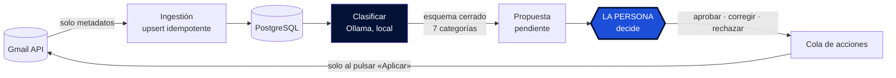

<p align="center">
  <picture>
    <source srcset="src/mailpilot/static/logo-oscuro.png" media="(prefers-color-scheme: dark)">
    
  </picture>
</p>

<p align="center">
  <a href="https://github.com/abrilespinosa/mailpilot/actions/workflows/tests.yml">
    
  </a>
  
  
  
</p>

<p align="center">
  <a href="README.md">English</a> · <b>Español</b>
</p>

---

# MailPilot

Capa de gestión inteligente sobre Gmail: clasifica el correo con un LLM que corre **en
local** y propone qué hacer con cada mensaje, sin ejecutar nada por su cuenta.

Proyecto personal de aprendizaje sobre arquitectura backend, sistemas de datos, IA
aplicada y seguridad.

---

## El principio, y no es negociable

> **La IA propone. La persona decide. MailPilot ejecuta solo lo autorizado.**

- El LLM **nunca** ejecuta acciones sobre Gmail.
- Toda acción pasa por: propuesta → validación → **aprobación humana explícita** →
  ejecución → registro de auditoría.
- El contenido de los correos **nunca sale de la máquina**. Todo el procesamiento de IA
  es local, con [Ollama](https://ollama.com). No se usa ninguna API de IA externa.
- La única acción destructiva es **mover a papelera**, reversible 30 días y deshacible
  desde el propio dashboard. El borrado permanente está fuera del alcance del proyecto,
  no solo del MVP: además el scope que se pide (`gmail.modify`) **no lo permitiría**, así
  que no depende de nuestra disciplina.
- **MailPilot no puede enviar correo.** Esa garantía sí depende del código, porque
  `gmail.modify` lo permitiría: la sostienen un enum cerrado de tres acciones, un único
  módulo autorizado a escribir, y un test que rastrea el código fuente.

---

## Stack

| | |
|---|---|
| **Lenguaje** | Python 3.14 |
| **API + dashboard** | FastAPI · Jinja2 — renderizado en servidor, sin framework JS |
| **Base de datos** | PostgreSQL 17 · SQLAlchemy 2 · Alembic |
| **IA local** | Ollama · qwen3:8b (Q4_K_M, 5,2 GB) |
| **Infra** | Docker Compose · GitHub Actions |
| **Tests** | pytest · 183 tests contra PostgreSQL de verdad |

**Coste cero.** Gmail API, modelos locales y herramientas de código abierto. Ninguna API
de IA de pago, nunca.

---

## Cómo funciona



1. **Ingestión** — se leen los mensajes con `format=metadata`: asunto, remitente,
   extracto, fecha y etiquetas. **El cuerpo de los correos no se descarga**, porque el
   modelo de datos no lo necesita. Lo que no se descarga no se puede filtrar.
2. **Persistencia** — `INSERT ... ON CONFLICT` sobre el id de Gmail. Reingerir mil veces
   deja las mismas filas.
3. **Clasificación** — un modelo local asigna una de siete categorías, con la generación
   restringida a un esquema cerrado.
4. **Propuesta** — cada clasificación genera una propuesta pendiente.
5. **Decisión** — se aprueba, se corrige o se rechaza. Lo que propuso el modelo se
   conserva intacto junto a lo que eligió la persona.
6. **Ejecución** — las acciones aprobadas se encolan y **solo cambian Gmail al pulsar
   «Aplicar»**. Ese paso intermedio es lo que hace revisable una acción destructiva: se
   puede ver qué está a punto de pasar antes de que pase.

---

## Dónde vive de verdad la seguridad

Fronteras de confianza, y qué módulo puede cruzarlas:


No existe ningún campo por el que el modelo pueda pedir una acción. Devuelve **una de
siete categorías, un número entre 0 y 1 y un texto de explicación** — y esa explicación
se le enseña a la persona pero **nunca se interpreta como instrucción**.

La defensa contra prompt injection es arquitectónica, no detección de frases:

| Barrera | Qué hace |
|---|---|
| **Decodificación restringida** | La generación se limita a un esquema JSON durante el muestreo de tokens. No es una petición amable en el prompt. |
| **Validación Pydantic** | Lo que no valide se descarta. Los campos que el modelo se invente se ignoran. |
| **ENUM nativo de PostgreSQL** | Última barrera, y se aplica aunque alguien escriba en la base de datos saltándose la aplicación. |
| **Autoescapado en la plantilla** | El asunto y la explicación se pintan como texto. Un correo con `<script>` se lee, no se ejecuta. |

Y un conjunto de tests que comprueban que algo **no existe**: que ningún módulo puede
enviar correo, que solo uno escribe en Gmail, que la lista de etiquetas quitables es
cerrada, que el servidor nunca abre el navegador. Se ejecutan en cada push.

---

## Probarlo en un minuto, sin cuenta de Gmail

```bash
python scripts/seed_demo.py
DATABASE_URL="$(grep -m1 '^DATABASE_URL' .env | cut -d= -f2-)_demo" uvicorn mailpilot.api:app
```

Diez correos inventados. Sin credenciales, sin OAuth, sin descargar ningún modelo.

**Dos de las propuestas están mal a propósito** —una es una cita médica leída como
compra, que es un fallo real medido en este proyecto— porque una demo donde la IA acierta
siempre no enseña para qué existe el paso humano. Un correo lleva `<script>` en el asunto,
así se ve funcionar el escapado.

Escribe en `<tu_base>_demo`, derivada igual que los tests derivan `_test`, así que no
puede tocar correo real.

---

## Evaluación: lo que costó llegar al número real

El clasificador se mide contra conjuntos de correos etiquetados a mano.

| Prompt | Conjunto | Acierto | |
|---|---|---|---|
| v1 | dev | 50,0 % | punto de partida |
| v2 | dev | 87,5 % | ⚠️ inflado: afinado sobre esos mismos correos |
| v2 | test | 70,0 % | primer conjunto limpio |
| v4 | test | 92,5 % | ⚠️ inflado: el prompt se escribió viendo sus fallos |
| **v4** | **test2** | **73,8 %** | **medición honesta** |
| v5 | test2 | 76,2 % | tras corregir el fallo que test2 destapó |
| **v5** | **test3** | **82,1 %** | **honesta, etiquetada a ciegas** |
| **v7** | **test6** | **82,5 %** | **honesta, etiquetada a ciegas** |

**El 92,5 % era un espejismo de 18,7 puntos.** Afinar el prompt mirando los fallos del
mismo conjunto con el que se mide infla el resultado, y solo un conjunto que nadie ha
tocado lo revela.

### Cinco cosas que enseñó medir bien

**Una palabra ambigua costaba 16 puntos.** La definición de `promociones` decía «ofertas
no solicitadas». En español *oferta* significa descuento **y** vacante de empleo, así que
los avisos de portales de trabajo caían en publicidad. Corregirlo llevó `trabajo` de 3/16
a 16/16. No era un fallo del modelo: era ambigüedad de la especificación.

**El acierto global puede subir mientras se rompe lo importante.** Una versión del prompt
subió al 86,2 % y hundió la categoría `personal` a 0 de 5: los correos de personas reales
acabaron en el cajón de dudas. Sin mirar la matriz de confusión, ese cambio parecía un
éxito.

**Enseñar la respuesta del modelo antes de preguntar cambia la respuesta.** Los mismos 160
correos, partidos por la mitad, mismo prompt, mismo día. Una mitad etiquetada viendo la
propuesta y la otra a ciegas:

| | a ciegas | viendo la propuesta |
|---|---|---|
| acierto global | 82,1 % | 85,0 % |
| acierto en la categoría ambigua | 65,4 % | 87,5 % |
| correcciones hacia esa categoría | 9 de 78 | 3 de 80 |

El efecto se concentra justo donde la decisión es dudosa: aprobar es un clic y llevarle la
contraria cuesta. Por eso el dashboard tiene **modo ciego** — y por eso el modo ciego es
ahora **el que viene por defecto**. Antes había que pedirlo con un parámetro, y una tanda
entera de 80 correos se perdió porque teclear la URL a secas lo quitaba sin avisar. De los
dos defectos posibles, solo uno falla de forma segura: olvidarte del modo ciego te quita
una ayuda; olvidarte del parámetro te corrompe los datos sin ninguna señal.

**Por debajo de ~18 puntos, con lotes de 80 correos, estás leyendo ruido.** Distinguir un
82 % de un 87 % con confianza exige unos 250 correos por lado. Varias comparaciones de la
tabla estaban por debajo de ese umbral: azar, contado como mejora. El prompt v7 le gana al
v5 por 0,4 puntos, que son z = 0,07: nada.

**La confianza del modelo no sirve como umbral.** Medido con dos modelos y siete versiones
de prompt, la diferencia de confianza entre aciertos y fallos nunca superó +0,07, y a
veces fue +0,004. Pedirle al modelo que se calibrara la empeoró.

> **Consecuencia de diseño:** no se puede aprobar nada automáticamente por confianza alta.
> Toda propuesta pasa por una persona.

### El modelo con más aciertos no siempre es el mejor

| Modelo | Acierto | `personal` |
|---|---|---|
| qwen3:8b | 70,0 % | 3/5 |
| llama3.1:8b | **73,8 %** | **0/5** |

llama3.1 acierta más, pero **nunca predijo `personal`**: mandó los cinco al cajón de
dudas. Perder correos de personas reales pesa mucho más que confundir una promoción, así
que se eligió qwen3. El criterio no es el porcentaje, es cuánto cuesta cada tipo de error.

### Dónde se estancó, y por qué no es culpa del prompt

`otros` es la peor categoría en las cuatro mediciones honestas. Significa dos cosas a la
vez —«boletín al que me suscribí» y «el modelo no sabe»— y ninguna versión de prompt
arregla una definición ambigua: solo mueve errores de sitio, que es exactamente lo que
lleva pasando desde el v3. Subir el número exige cambiar la especificación, no la
redacción.

---

## Estado

- [x] **Fase 1** — Gmail API + OAuth 2.0
- [x] **Fase 2** — Ingestión idempotente
- [x] **Fase 3** — Modelo de datos con SQLAlchemy + Alembic
- [x] **Fase 4** — API con FastAPI
- [x] **Fase 5** — Clasificación local con Ollama
- [x] **Fase 6** — Evaluación con conjuntos etiquetados — **cerrada en 82,5 %**
- [x] **Fase 7** — Sistema de propuestas y decisiones
- [x] **Fase 8** — Dashboard, modo ciego por defecto
- [x] **Fase 9** — Acciones reales: etiquetar, archivar, papelera, recuperar
- [ ] **Fase 10+** — Observabilidad, Docker completo, documento de threat model

---

## Puesta en marcha

**Requisitos:** Docker, Python 3.14, [Ollama](https://ollama.com) y credenciales OAuth de
la Gmail API.

```bash
python -m venv venv && source venv/bin/activate
pip install -e ".[dev]"       # editable: sin copiar, sin reinstalar al editar

cp .env.example .env          # y rellenar

docker compose up -d          # PostgreSQL
alembic upgrade head          # crear el esquema

ollama pull qwen3:8b
```

Las credenciales de Google (`credentials/client_secret.json`) se descargan de Google Cloud
Console. La carpeta está excluida del repositorio.

### Uso

```bash
python scripts/test_auth.py            # verificar OAuth
python scripts/ingest.py --limit 80    # Gmail -> PostgreSQL
python scripts/classify.py             # clasificar con Ollama
python scripts/propose.py              # generar propuestas

uvicorn mailpilot.api:app --reload
```

- `http://localhost:8000/` — **el dashboard**, en modo ciego. Siete chips de categoría por
  correo, y la papelera como gesto aparte, porque «qué es esto» y «no lo quiero» son dos
  preguntas distintas. Con `?ciego=0` se ve lo que propuso el modelo, a cambio de que esa
  tanda deje de valer como medición.
- `http://localhost:8000/docs` — documentación interactiva de la API, generada sola a
  partir de los tipos.

El dashboard **no tiene endpoints de escritura propios**: sirve HTML y sus botones llaman
a la misma API JSON que usaría cualquier otro cliente. Así las reglas viven en un único
sitio y la pantalla no es un camino privilegiado. Un test recorre sus rutas y exige que
todas sean `GET`.

### Tests

```bash
pytest                    # todo (necesita PostgreSQL levantado)
pytest -m "not db"        # solo los que no tocan la base de datos
pytest -k idempot         # por patrón
```

PostgreSQL de verdad y no SQLite, a propósito: el esquema usa ENUM nativos y JSONB. Con
SQLite los tests pasarían y producción fallaría, que es lo peor que puede hacer un test.

---

## Estructura

```
src/mailpilot/
  auth.py           credenciales OAuth (único módulo que accede a credentials/)
  gmail.py          lectura de la Gmail API
  db.py             motor y sesiones
  models.py         cinco tablas + los enums cerrados
  schemas.py        esquemas de la API, separados de los modelos a propósito
  repository.py     persistencia, propuestas y decisiones
  classifier.py     clasificación con Ollama
  api.py            FastAPI: la API JSON, único camino de escritura
  gmail_actions.py  el ÚNICO módulo que escribe en Gmail
  web.py            dashboard: solo rutas GET, solo sirve HTML
  templates/        dashboard.html
migrations/         Alembic
scripts/            herramientas manuales, incluido seed_demo.py
evaluation/         conjuntos etiquetados (los datos no se versionan)
docs/decisions/     ADRs
```

**Los esquemas de la API están separados de los modelos de base de datos a propósito.**
Así, añadir una columna a una tabla no la publica sola por HTTP: exponer un campo es una
decisión explícita. Un test fija el conjunto exacto de campos que devuelve el listado.

---

## Seguridad y privacidad

- El contenido de los correos **no sale de la máquina**.
- **No se descarga el cuerpo** de los mensajes: solo asunto, remitente y extracto.
- Credenciales, `.env` y datos de evaluación excluidos del repositorio, y el historial
  completo se auditó antes de hacer público este repo.
- PostgreSQL escucha **solo en `127.0.0.1`**, nunca expuesto a la red local.
- El scope de OAuth es el mínimo que hace el trabajo (`gmail.modify`), y esa minimalidad
  **es** la barrera: el borrado permanente exige el scope completo, que no se pide nunca.
- Los endpoints de escritura son una **lista blanca verificada por un test**: cualquier
  ruta de escritura nueva lo hace fallar hasta que se añada a conciencia.
- **No existe ningún endpoint `DELETE`**, y un test lo garantiza.
- Un token caducado devuelve un 503 con instrucciones en vez de colgar la petición: el
  servidor no puede entrar nunca en el flujo interactivo del navegador.

---

## Decisiones de arquitectura

En [`docs/decisions/`](docs/decisions/), cada una con contexto, alternativas descartadas y
consecuencias.

- [**ADR 001** — Categorías de clasificación](docs/decisions/001-categorias-de-clasificacion.md)
  — por qué siete, por qué un enum cerrado, y cómo cambiaron las definiciones al medirlas
  contra correo real.
- [**ADR 002** — Tirar no es corregir](docs/decisions/002-tirar-no-es-corregir.md)
  — por qué «esto es promociones» y «esto lo tiro» son decisiones separadas. Mezclarlas
  habría subido el acierto medido 3,3 puntos borrando el 42 % de la muestra.
- [**ADR 003** — Subir el scope a `gmail.modify`](docs/decisions/003-scope-gmail-modify.md)
  — por qué el scope mínimo **es** la barrera de seguridad, y qué garantía impone Google
  frente a cuál sostiene solo nuestro código.
- [**ADR 004** — Clasificar archiva](docs/decisions/004-clasificar-archiva.md)
  — quitar INBOX es lo que significa archivar en Gmail, y cómo la regla de etiquetas
  quitables se estrechó en vez de abrirse para permitirlo.
- [**ADR 005** — Paquete instalable](docs/decisions/005-paquete-instalable.md)
  — por qué `src` salió del path de pytest: dejarlo permitiría que los tests pasaran con
  la instalación rota.

---

## Licencia

[MIT](LICENSE) © Abril Espinosa.

La licencia cubre este código. No cubre la Gmail API (mandan los términos de Google),
el modelo de lenguaje (que tiene la suya) ni los conjuntos de evaluación etiquetados a
mano, que no se publican nunca.

---

<p align="center"><i>La IA propone. La persona decide.</i></p>
