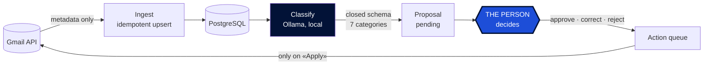
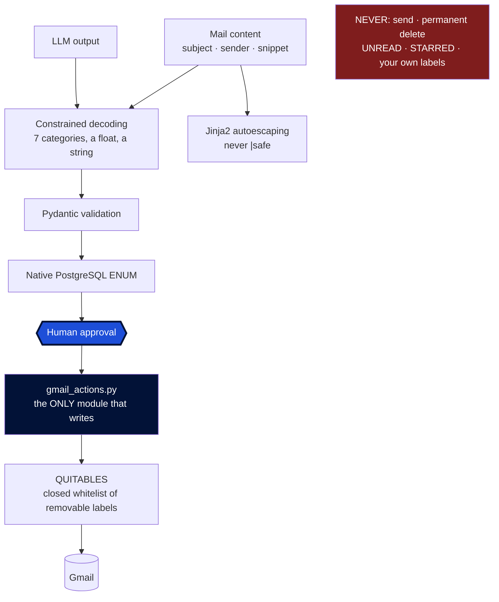

<p align="center">
  <picture>
    <source srcset="src/mailpilot/static/logo-oscuro.png" media="(prefers-color-scheme: dark)">
    
  </picture>
</p>

<p align="center">
  <a href="https://github.com/abrilespinosa/mailpilot/actions/workflows/tests.yml">
    
  </a>
  
  
  
</p>

<p align="center">
  <b>English</b> · <a href="README.es.md">Español</a>
</p>

---

# MailPilot

An intelligent management layer over Gmail. A **locally-run** LLM classifies your mail
and proposes what to do with each message — and never acts on its own.

A personal learning project about backend architecture, data systems, applied AI and
security.

> **Note on language.** The README is in English; the dashboard is in Spanish. This is a
> personal tool built in its author's language, and the seven categories are Spanish all
> the way down — the database ENUM, the Gmail labels, the prompt, and 420 hand-labelled
> mails. Translating the interface alone would leave English buttons reading
> `promociones`; translating it properly would invalidate every measurement below.

---

## The principle, and it is not negotiable

> **The AI proposes. The person decides. MailPilot executes only what was authorised.**

- The LLM **never** acts on Gmail.
- Every action goes through: proposal → validation → **explicit human approval** →
  execution → audit log.
- Mail content **never leaves the machine**. All AI runs locally with
  [Ollama](https://ollama.com). No external AI API is used, ever.
- The only destructive action is **move to trash**, reversible for 30 days and undoable
  from the dashboard itself. Permanent deletion is out of scope for the project, not just
  the MVP — and the requested scope (`gmail.modify`) **could not do it anyway**, so that
  guarantee does not rest on our discipline.
- **MailPilot cannot send mail.** *That* guarantee does rest on the code, because
  `gmail.modify` would allow it. It is held up by a closed three-value enum, a single
  module authorised to write, and a test that greps the source.

---

## Stack

| | |
|---|---|
| **Language** | Python 3.14 |
| **API + dashboard** | FastAPI · Jinja2 — server-rendered, no JS framework |
| **Database** | PostgreSQL 17 · SQLAlchemy 2 · Alembic |
| **Local AI** | Ollama · qwen3:8b (Q4_K_M, 5.2 GB) |
| **Infra** | Docker Compose · GitHub Actions |
| **Tests** | pytest · 183 tests against real PostgreSQL |

**Zero cost.** Gmail API, local models and open-source tooling. No paid AI API, ever.

---

## How it works



1. **Ingest** — messages are read with `format=metadata`: subject, sender, snippet, date
   and labels. **Message bodies are never downloaded**, because the data model does not
   need them. What you never download cannot leak.
2. **Persist** — `INSERT ... ON CONFLICT` on the Gmail id. Re-ingesting a thousand times
   leaves the same rows.
3. **Classify** — a local model assigns one of seven categories, with generation
   constrained to a closed schema.
4. **Propose** — each classification becomes a pending proposal.
5. **Decide** — approve, correct or reject. What the model said is kept intact alongside
   what the person chose.
6. **Execute** — approved actions are queued and **only touch Gmail when you press
   «Apply»**. That gap is what makes a destructive action reviewable: you can see what is
   about to happen before it happens.

---

## Where the safety actually lives

Trust boundaries, and which module is allowed to cross them:



There is no field through which the model can request an action. It returns **one of
seven categories, a number between 0 and 1, and a free-text reason** — and the reason is
shown to the person but **never interpreted as an instruction**.

The defence against prompt injection is architectural, not phrase detection:

| Barrier | What it does |
|---|---|
| **Constrained decoding** | Generation is restricted to a JSON schema during token sampling. Not a polite request in the prompt. |
| **Pydantic validation** | Anything that fails to validate is discarded. Invented fields are ignored. |
| **Native PostgreSQL ENUM** | Last line, enforced even if someone writes to the database directly. |
| **Template autoescaping** | Subject and model reason are rendered as text. A mail carrying `<script>` gets read, not executed. |

And a set of tests that assert something does **not** exist: that no module can send
mail, that only one writes to Gmail, that the removable-label set is closed, that the
server never opens a browser. They run on every push.

---

## Try it in one minute, with no Gmail account

```bash
python scripts/seed_demo.py
DATABASE_URL="$(grep -m1 '^DATABASE_URL' .env | cut -d= -f2-)_demo" uvicorn mailpilot.api:app
```

Ten invented mails. No credentials, no OAuth, no model download.

**Two of the proposals are deliberately wrong** — including a medical appointment read as
a purchase, which is a real failure this project measured — because a demo where the AI is
always right never shows why the human step exists. One mail carries a `<script>` tag in
its subject, so you can watch the escaping work.

It writes to `<your_database>_demo`, derived the way the test suite derives `_test`, so it
cannot touch real mail.

---

## Evaluation: what it cost to get an honest number

The classifier is measured against hand-labelled sets.

| Prompt | Set | Accuracy | |
|---|---|---|---|
| v1 | dev | 50.0 % | starting point |
| v2 | dev | 87.5 % | ⚠️ inflated: tuned on those same mails |
| v2 | test | 70.0 % | first clean set |
| v4 | test | 92.5 % | ⚠️ inflated: prompt written while reading its mistakes |
| **v4** | **test2** | **73.8 %** | **honest** |
| v5 | test2 | 76.2 % | after fixing what test2 exposed |
| **v5** | **test3** | **82.1 %** | **honest, labelled blind** |
| **v7** | **test6** | **82.5 %** | **honest, labelled blind** |

**That 92.5 % was an 18.7-point mirage.** Tuning a prompt against the mistakes of the set
you then measure with inflates the result, and only a set nobody has touched reveals it.

### Five things that measuring properly taught

**One ambiguous word cost 16 points.** The definition of `promociones` said "unsolicited
offers". In Spanish, *oferta* means both *discount* and *job vacancy*, so job-board alerts
landed in advertising. Fixing the wording took `trabajo` from 3/16 to 16/16. Not a model
failure — an ambiguous specification.

**Overall accuracy can rise while the thing that matters breaks.** One prompt version
climbed to 86.2 % and drove the `personal` category to 0 of 5: mail from actual people
ended up in the catch-all bin. Without reading the confusion matrix, that looked like a
win.

**Showing the model's answer before asking changes the answer.** The same 160 mails, split
in half, same prompt, same day. One half labelled while seeing the proposal, the other
blind:

| | blind | seeing the proposal |
|---|---|---|
| overall accuracy | 82.1 % | 85.0 % |
| accuracy on the ambiguous category | 65.4 % | 87.5 % |
| corrections toward that category | 9 of 78 | 3 of 80 |

The effect concentrates exactly where the call is genuinely doubtful: approving is one
click and disagreeing costs effort. That is why the dashboard has a **blind mode** — and
why blind mode is now the **default**. It used to be opt-in via a query parameter, and a
whole batch of 80 mails was lost to a bare URL that silently dropped it. Of the two
possible defaults, only one fails safely: forgetting blind mode costs you a hint,
forgetting the parameter corrupts your data with no signal at all.

**Below ~18 points, at 80 mails per batch, you are reading noise.** Telling 82 % from
87 % with any confidence needs roughly 250 mails per side. Several comparisons in the
table above sat under that threshold — chance, reported as improvement. Prompt v7 beats v5
by 0.4 points, which is z = 0.07: nothing.

**Model confidence is useless as a threshold.** Across two models and seven prompt
versions, the confidence gap between right and wrong answers never exceeded +0.07, and was
sometimes +0.004. Asking the model to calibrate itself made it worse.

> **Design consequence:** nothing can be auto-approved on high confidence. Every proposal
> goes past a person.

### The most accurate model is not always the best one

| Model | Accuracy | `personal` |
|---|---|---|
| qwen3:8b | 70.0 % | 3/5 |
| llama3.1:8b | **73.8 %** | **0/5** |

llama3.1 scores higher but **never once predicted `personal`**: it sent all five to the
catch-all. Losing mail from real people costs far more than misfiling a promotion, so
qwen3 was chosen. The criterion is not the percentage — it is what each kind of error
costs.

### Where it plateaued, and why the prompt is not to blame

`otros` is the worst category in all four honest measurements. It means two different
things at once — "a newsletter I subscribed to" and "the model is unsure" — and no prompt
version fixes an ambiguous definition. It only moves errors around, which is exactly what
has been happening since v3. Raising the number requires changing the specification, not
the wording.

---

## Status

- [x] **Phase 1** — Gmail API + OAuth 2.0
- [x] **Phase 2** — Idempotent ingestion
- [x] **Phase 3** — Data model with SQLAlchemy + Alembic
- [x] **Phase 4** — FastAPI backend
- [x] **Phase 5** — Local classification with Ollama
- [x] **Phase 6** — Evaluation against hand-labelled sets — **closed at 82.5 %**
- [x] **Phase 7** — Proposals and decisions
- [x] **Phase 8** — Dashboard, blind mode by default
- [x] **Phase 9** — Real Gmail actions: label, archive, trash, restore
- [ ] **Phase 10+** — Observability, full Docker, threat model document

---

## Getting started

**Requirements:** Docker, Python 3.14, [Ollama](https://ollama.com), and Gmail API OAuth
credentials.

```bash
python -m venv venv && source venv/bin/activate
pip install -e ".[dev]"       # editable: no copying, no reinstall after edits

cp .env.example .env          # then fill it in

docker compose up -d          # PostgreSQL
alembic upgrade head          # create the schema

ollama pull qwen3:8b
```

Google credentials (`credentials/client_secret.json`) come from Google Cloud Console. The
folder is excluded from the repository.

### Use

```bash
python scripts/test_auth.py            # verify OAuth
python scripts/ingest.py --limit 80    # Gmail -> PostgreSQL
python scripts/classify.py             # classify with Ollama
python scripts/propose.py              # generate proposals

uvicorn mailpilot.api:app --reload
```

- `http://localhost:8000/` — **the dashboard**, in blind mode. Seven category chips per
  mail, plus a separate trash gesture, because "what is this" and "I don't want it" are
  two different questions. Add `?ciego=0` to see what the model proposed — at the cost of
  that batch no longer counting as a measurement.
- `http://localhost:8000/docs` — interactive API docs, generated from the type hints.

The dashboard **has no write endpoints of its own**: it serves HTML, and its buttons call
the same JSON API any other client would. Rules live in one place and the screen is not a
privileged path. A test walks its routes and requires every one to be `GET`.

### Tests

```bash
pytest                    # everything (needs PostgreSQL running)
pytest -m "not db"        # only the ones that skip the database
pytest -k idempot         # by pattern
```

Real PostgreSQL, not SQLite, on purpose: the schema needs native ENUMs and JSONB. With
SQLite the tests would pass while production broke — the worst thing a test can do.

---

## Layout

```
src/mailpilot/
  auth.py           OAuth credentials (the only module touching credentials/)
  gmail.py          reading the Gmail API
  db.py             engine and sessions
  models.py         five tables + the closed enums
  schemas.py        API schemas, deliberately separate from the DB models
  repository.py     persistence, proposals and decisions
  classifier.py     classification with Ollama
  api.py            FastAPI: the JSON API, the only write path
  gmail_actions.py  the ONLY module that writes to Gmail
  web.py            dashboard: GET routes only, HTML only
  templates/        dashboard.html
migrations/         Alembic
scripts/            manual tools, including seed_demo.py
evaluation/         labelled sets (the data itself is not versioned)
docs/decisions/     ADRs
```

**API schemas are kept separate from database models on purpose.** Adding a column to a
table does not publish it over HTTP: exposing a field is an explicit decision. A test pins
the exact set of fields the listing returns.

---

## Security and privacy

- Mail content **never leaves the machine**.
- **Message bodies are never downloaded** — only subject, sender and snippet.
- Credentials, `.env` and evaluation data are excluded from the repository, and the full
  commit history was audited before this repo was made public.
- PostgreSQL listens on **`127.0.0.1` only**, never exposed to the local network.
- The OAuth scope is the minimum that does the job (`gmail.modify`), and that minimality
  *is* the barrier: permanent deletion requires the full scope, which is never requested.
- Write endpoints are an explicit **allowlist checked by a test**: any new write route
  fails the suite until it is added deliberately.
- **There is no `DELETE` endpoint**, and a test guarantees it.
- An expired token returns a 503 with instructions instead of hanging the request: the
  server can never enter the interactive browser flow.

---

## Architecture decisions

In [`docs/decisions/`](docs/decisions/), each with context, rejected alternatives and
consequences.

- [**ADR 001** — Classification categories](docs/decisions/001-categorias-de-clasificacion.md)
  — why seven, why a closed enum, and how the definitions changed once measured against
  real mail.
- [**ADR 002** — Trashing is not correcting](docs/decisions/002-tirar-no-es-corregir.md)
  — why "this is promotions" and "I don't want this" are separate decisions. Merging them
  would have raised measured accuracy by 3.3 points while deleting 42 % of the sample.
- [**ADR 003** — Escalating to `gmail.modify`](docs/decisions/003-scope-gmail-modify.md)
  — why the minimal scope *is* the security barrier, and which guarantee Google enforces
  versus which one only our own code does.
- [**ADR 004** — Classifying archives](docs/decisions/004-clasificar-archiva.md)
  — removing INBOX is what archiving means in Gmail, and how the removable-label rule was
  narrowed rather than widened to allow it.
- [**ADR 005** — An installable package](docs/decisions/005-paquete-instalable.md)
  — why `src` was dropped from pytest's path: leaving it in would let the tests pass with
  a broken install.

---

## License

[MIT](LICENSE) © Abril Espinosa.

The licence covers this code. It does not cover the Gmail API (Google's terms apply),
the language model (which carries its own licence), or the hand-labelled evaluation
data, which is never published.

---

<p align="center"><i>The AI proposes. The person decides.</i></p>
