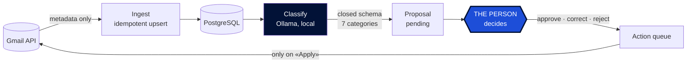
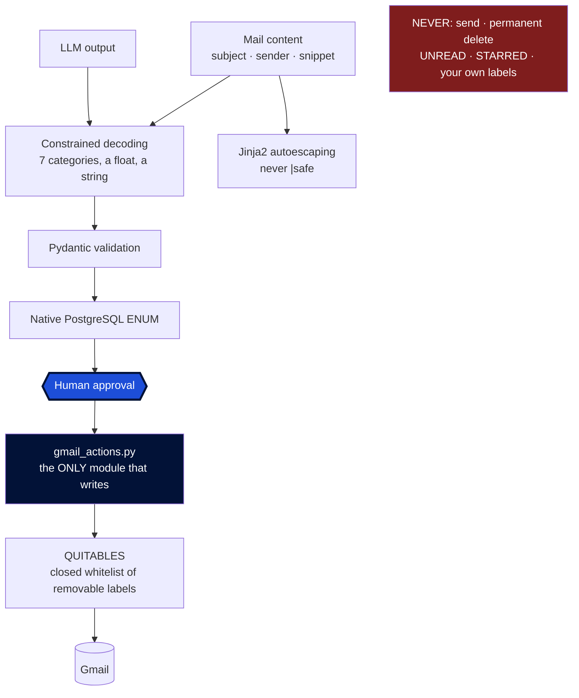

<p align="center">
  <picture>
    <source srcset="src/mailpilot/static/logo-oscuro.png" media="(prefers-color-scheme: dark)">
    
  </picture>
</p>

<p align="center">
  <a href="https://github.com/abrilespinosa/mailpilot/actions/workflows/tests.yml">
    
  </a>
  
  
  
</p>

<p align="center">
  <b>English</b> · <a href="README.es.md">Español</a>
</p>

---

# MailPilot

An intelligent management layer over Gmail. A **locally-run** LLM classifies your mail
and proposes what to do with each message — and never acts on its own.

A personal learning project about backend architecture, data systems, applied AI and
security.

> **Note on language.** The README is in English; the dashboard is in Spanish. This is a
> personal tool built in its author's language, and the ten categories are Spanish all
> the way down — the database ENUM, the Gmail labels, the prompt, and 450 hand-labelled
> mails. Translating the interface alone would leave English buttons reading
> `promociones`; translating it properly would invalidate every measurement below.

---

## The principle, and it is not negotiable

> **The AI proposes. The person decides. MailPilot executes only what was authorised.**

- The LLM **never** acts on Gmail.
- Every action goes through: proposal → validation → **explicit human approval** →
  execution → audit log.
- Mail content **never leaves the machine**. All AI runs locally with
  [Ollama](https://ollama.com). No external AI API is used, ever.
- The only destructive action is **move to trash**, reversible for 30 days and undoable
  from the dashboard itself. Permanent deletion is out of scope for the project, not just
  the MVP — and the requested scope (`gmail.modify`) **could not do it anyway**, so that
  guarantee does not rest on our discipline.
- **MailPilot cannot send mail.** *That* guarantee does rest on the code, because
  `gmail.modify` would allow it. It is held up by a closed three-value enum, a single
  module authorised to write, and a test that greps the source.

---

## Stack

| | |
|---|---|
| **Language** | Python 3.14 |
| **API + dashboard** | FastAPI · Jinja2 — server-rendered, no JS framework |
| **Database** | PostgreSQL 17 · SQLAlchemy 2 · Alembic |
| **Local AI** | Ollama · qwen3:8b (Q4_K_M, 5.2 GB) |
| **Infra** | Docker Compose · GitHub Actions |
| **Tests** | pytest · 200 tests against real PostgreSQL |

**Zero cost.** Gmail API, local models and open-source tooling. No paid AI API, ever.

---

## How it works



1. **Ingest** — messages are read with `format=metadata`: subject, sender, snippet, date
   and labels. **Message bodies are never downloaded**, because the data model does not
   need them. What you never download cannot leak.
2. **Persist** — `INSERT ... ON CONFLICT` on the Gmail id. Re-ingesting a thousand times
   leaves the same rows.
3. **Classify** — a local model assigns one of ten categories, with generation
   constrained to a closed schema.
4. **Propose** — each classification becomes a pending proposal.
5. **Decide** — approve, correct or reject. What the model said is kept intact alongside
   what the person chose.
6. **Execute** — approved actions are queued and **only touch Gmail when you press
   «Apply»**. That gap is what makes a destructive action reviewable: you can see what is
   about to happen before it happens.

---

## Where the safety actually lives

Trust boundaries, and which module is allowed to cross them:



There is no field through which the model can request an action. It returns **one of
ten categories, a number between 0 and 1, and a free-text reason** — and the reason is
shown to the person but **never interpreted as an instruction**.

The defence against prompt injection is architectural, not phrase detection:

| Barrier | What it does |
|---|---|
| **Constrained decoding** | Generation is restricted to a JSON schema during token sampling. Not a polite request in the prompt. |
| **Pydantic validation** | Anything that fails to validate is discarded. Invented fields are ignored. |
| **Native PostgreSQL ENUM** | Last line, enforced even if someone writes to the database directly. |
| **Template autoescaping** | Subject and model reason are rendered as text. A mail carrying `<script>` gets read, not executed. |

And a set of tests that assert something does **not** exist: that no module can send
mail, that only one writes to Gmail, that the removable-label set is closed, that the
server never opens a browser. They run on every push.

---

## Try it in one minute, with no Gmail account


Recorded against the demo data below. The first card is the one worth watching. The model's
reasoning is sound — *a confirmation with a date, a time and a link to manage it* — and its
answer is wrong anyway, at **0.95 confidence**. That is why nothing here auto-approves on a
confidence threshold, and why the classified view keeps the model's answer next to yours:
every disagreement is a correctly labelled mail obtained from ordinary use.

The bar on top reads *two actions waiting, nothing has changed in Gmail yet*. Deciding and
executing are separate steps, and only the second one touches your account.

```bash
python scripts/seed_demo.py
DATABASE_URL="$(grep -m1 '^DATABASE_URL' .env | cut -d= -f2-)_demo" uvicorn mailpilot.api:app
```

Ten invented mails. No credentials, no OAuth, no model download.

**Two of the proposals are deliberately wrong** — including a medical appointment read as
a purchase, which is a real failure this project measured — because a demo where the AI is
always right never shows why the human step exists. One mail carries a `<script>` tag in
its subject, so you can watch the escaping work.

It writes to `<your_database>_demo`, derived the way the test suite derives `_test`, so it
cannot touch real mail.

---

## Evaluation: what it cost to get an honest number

The classifier is measured against hand-labelled sets.

| Prompt | Set | Accuracy | |
|---|---|---|---|
| v1 | dev | 50.0 % | starting point |
| v2 | dev | 87.5 % | ⚠️ inflated: tuned on those same mails |
| v2 | test | 70.0 % | first clean set |
| v4 | test | 92.5 % | ⚠️ inflated: prompt written while reading its mistakes |
| **v4** | **test2** | **73.8 %** | **honest** |
| v5 | test2 | 76.2 % | after fixing what test2 exposed |
| **v5** | **test3** | **82.1 %** | **honest, labelled blind** |
| **v7** | **test6** | **82.5 %** | **honest, labelled blind** |

**That 92.5 % was an 18.7-point mirage.** Tuning a prompt against the mistakes of the set
you then measure with inflates the result, and only a set nobody has touched reveals it.

### Five things that measuring properly taught

**One ambiguous word cost 16 points.** The definition of `promociones` said "unsolicited
offers". In Spanish, *oferta* means both *discount* and *job vacancy*, so job-board alerts
landed in advertising. Fixing the wording took `trabajo` from 3/16 to 16/16. Not a model
failure — an ambiguous specification.

**Overall accuracy can rise while the thing that matters breaks.** One prompt version
climbed to 86.2 % and drove the `personal` category to 0 of 5: mail from actual people
ended up in the catch-all bin. Without reading the confusion matrix, that looked like a
win.

**Showing the model's answer before asking changes the answer.** The same 160 mails, split
in half, same prompt, same day. One half labelled while seeing the proposal, the other
blind:

| | blind | seeing the proposal |
|---|---|---|
| overall accuracy | 82.1 % | 85.0 % |
| accuracy on the ambiguous category | 65.4 % | 87.5 % |
| corrections toward that category | 9 of 78 | 3 of 80 |

The effect concentrates exactly where the call is genuinely doubtful: approving is one
click and disagreeing costs effort. That is why the dashboard has a **blind mode** — and
why blind mode is now the **default**. It used to be opt-in via a query parameter, and a
whole batch of 80 mails was lost to a bare URL that silently dropped it. Of the two
possible defaults, only one fails safely: forgetting blind mode costs you a hint,
forgetting the parameter corrupts your data with no signal at all.

**Below ~18 points, at 80 mails per batch, you are reading noise.** Telling 82 % from
87 % with any confidence needs roughly 250 mails per side. Several comparisons in the
table above sat under that threshold — chance, reported as improvement. Prompt v7 beats v5
by 0.4 points, which is z = 0.07: nothing.

**Model confidence is useless as a threshold.** Across two models and seven prompt
versions, the confidence gap between right and wrong answers never exceeded +0.07, and was
sometimes +0.004. Asking the model to calibrate itself made it worse.

> **Design consequence:** nothing can be auto-approved on high confidence. Every proposal
> goes past a person.

### The most accurate model is not always the best one

| Model | Accuracy | `personal` |
|---|---|---|
| qwen3:8b | 70.0 % | 3/5 |
| llama3.1:8b | **73.8 %** | **0/5** |

llama3.1 scores higher but **never once predicted `personal`**: it sent all five to the
catch-all. Losing mail from real people costs far more than misfiling a promotion, so
qwen3 was chosen. The criterion is not the percentage — it is what each kind of error
costs.

### Where it plateaued, and what actually fixed it

`otros` was the worst category in all four honest measurements. It meant two different
things at once — "a newsletter I subscribed to" and "the model is unsure" — and no prompt
version fixes an ambiguous definition. It only moves errors around, which is exactly what
had been happening since v3.

So the fix was not another prompt. **The categories were redefined.**

The trigger was two symptoms that turned out to be the same problem: I hesitated when
labelling ordinary mail, and the model had been stuck at 82 % across four prompt
versions. My own 738 labels showed where — `avisos` was 31 % of everything and held three
unrelated things inside it, and `trabajo` was not about work at all: 75 of its 80 mails
came from job boards.

**The categories had been defined by topic, and topics have no edges.** Seven became ten,
and each one is now defined by **a question with a checkable answer** rather than a theme:

| | The question that decides |
|---|---|
| `personal` | did a person write this, to me? |
| `seguridad` | is this about accessing an account of mine? |
| `tramites` | are there consequences if I ignore it? |
| `compras` | is this about something I already bought? |
| `empleo` | is this about getting work? |
| `boletines` | did I subscribe to this? |
| `social` | is this social network activity? |
| `avisos` | is a service I use telling me something operational? |
| `promociones` | is it trying to sell me something **right now**? |
| `otros` | only "fits nowhere else" |

A topic can be read ten ways; a fact cannot. And `otros` stopped being a bin and became a
**health metric**: since it now only means "fits nowhere", it going above 5 % is the
signal that a category is missing. Across 450 hand-labelled mails it came out at **zero**.

---

## Then I trained my own classifier

With the categories fixed, the errors changed shape. They stopped coming in groups.

That matters, because a group of errors can be caught with a rule — one prompt fix took
`trabajo` from 7/13 to 13/13. But after the redefinition the remaining mistakes were
**seven different confusions, none repeated**. There was no rule left to write: the
criteria were right, and what was missing was information. The model sees a sender, a
subject and a ~180-character preview — empty for 146 of the 2,498 mails.

It also wastes the strongest signal available. Every time mail arrives from
`goodreads.com`, the LLM re-reads all ten definitions and reasons from scratch. A trained
model learns that domain once.

So I trained one: **TF-IDF + logistic regression**, on my own 450 labels, and measured it
against qwen3 **on the same test mails**.

### The set-up

The honest part of this is not the model — it is twenty lines of scikit-learn. It is the
measurement.

- **Only labels decided blind.** Seeing the model's guess first pushes you to agree with
  it, so an anchored label would teach the new model to copy the old one's biases.
- **The 371 labels I already had were thrown away.** They mixed anchored decisions with
  the old seven-category taxonomy, and nothing recorded which was which. That is why the
  database now has a `decidido_a_ciegas` column, and why 450 mails were relabelled from
  scratch against **blank proposals** — no model opinion shown at all.
- **359 train / 91 test**, stratified, seed frozen to a file. The script refuses to
  regenerate it: redoing the split would move mails between the two halves and silently
  invalidate every earlier measurement.

### The result

| | Accuracy | Time per mail |
|---|---|---|
| Always answer the most common category | 20.9 % | — |
| **Trained model** | **73.6 %** | **0.001 s** |
| **qwen3:8b, prompt v8** | **72.5 %** | **6.3 s** |

A tie — McNemar over the 31 mails they disagree on gives z = 0.00. Twenty lines of
scikit-learn, trained in under a second, match an 8-billion-parameter LLM and classify
6,000 times faster.

**And the 82 % quoted throughout this README was never comparable.** It was measured with
the seven-category taxonomy on different sets. Measured properly, on the same blind-
labelled mails, qwen3 sits at 72.5 %.

### What is actually interesting: they fail on different mail

| Category | Trained | qwen3 | |
|---|---|---|---|
| `promociones` | **0.89** | 0.42 | trained wins |
| `empleo` | **0.91** | 0.73 | trained wins |
| `social` | **0.86** | 0.50 | trained wins |
| `avisos` | **0.65** | 0.45 | trained wins |
| `compras` | 0.89 | **0.95** | qwen3 wins |
| `personal` | 0.75 | **0.87** | qwen3 wins |
| `seguridad` | 0.72 | **0.85** | qwen3 wins |
| `tramites` | 0.62 | **0.84** | qwen3 wins |

*(F1 score: a single number combining precision and recall.)*

The split is not random. **The trained model wins where the sender decides it** —
`promociones` scores 0.89 from just 16 training examples, because "stradivarius" and
"fnac" are enough. **qwen3 wins where the mail has to be understood** — `personal` (is
there a person behind this?) and `tramites` (are there consequences if I ignore it?).

Which leads to the number that matters:

```
both wrong                 9
only the trained one wrong 15
only qwen3 wrong          16
────────────────────────────
ceiling if combined    90.1 %
```

**Only 9 of 91 mails defeat both.** Something that always picked the right one of the two
would reach 90.1 %, against 73.6 % for the better one alone — 16.5 points of headroom.
That is a measured argument for a hybrid, not a guess: the fast model handles what the
sender decides, and the LLM is called only when the mail has to be read.

### What the trained model learned

Unlike the LLM, its weights can be read back:

| Category | Strongest signals |
|---|---|
| `boletines` | goodreads · mail goodreads |
| `promociones` | stradivarius · fnac · verano |
| `seguridad` | google · cuenta · sesión · github |
| `personal` | gmail.com · my own address |
| `tramites` | bbva · fnmt · solicitud |

Nobody wrote any of those rules. They came out of 359 examples.

And the failure is legible too. `avisos` is the worst category, and its strongest signals
are "kaggle" and "bienvenida" — it never found a pattern, it memorised individual
senders. That is the same category where **my own labelling was inconsistent**: two
near-identical mails from my bank went to different categories. **The model learned my
own uncertainty**, and no amount of code fixes that.

### Honest limits

- **91 test mails.** Differences under ~10 points are noise. The tie is a real tie.
- `social` (3 in test) and `promociones` (4) cannot support any per-category claim,
  however good their scores look.
- **The 90.1 % is a ceiling, not a result.** It assumes a perfect referee that does not
  exist yet. Building one is the next problem — and it needs a fresh set of blind labels,
  because this test set has now been looked at.

## Then the numbers fell, and that turned out to be the useful part

A second test set — 199 fresh blind labels — and both scores collapsed:

| | test gen 1 (91) | test gen 2 (199) | |
|---|---|---|---|
| trained model | 75.8 % | **60.3 %** | −15.5 |
| qwen3:8b | 72.5 % | **54.3 %** | −18.2 |

**This is why keeping the LLM around is worth more than its accuracy.** qwen3 learns
nothing: same model, same prompt, a fixed function. When a fixed instrument reads 72.5
and then 54.3, what changed is not the instrument — it is the mail (p ≈ 0.002). Which
also kills the obvious explanation: "TF-IDF memorised old senders and cannot generalise"
is false, because the trained model fell *less* than the fixed yardstick did.

A model that does not learn, measuring next to one that does, is the only thing that
tells "my model got worse" apart from "the exam got harder".

Cross-validation inside the training set says 77.8 %; the test says 60.3 %. Those 17.5
points are the price of a random split. **The 75.8 % never measured mail from another
period** — its test was a random sample from the same window as its training data.

### The direction of that shift is the opposite of what I assumed

Labelling walks backwards in time. Blank proposals are ordered newest-first among the
unlabelled, so the first batch took the newest mail and every batch since has gone
further back:

```
train (559)       2025-05 .. 2026-08
test gen 2 (199)  2024-12 .. 2025-05
```

**The test set is older than the training set, not newer.** I had this backwards for a
while, and it changes what the collapse means: there is no mystery about recent mail
being hard. The model was trained on one period and examined on a different, earlier one.

It also explains a detail that looked spooky. `empleo` is 6.1 % of training and exactly
0 % of the test — P(0 of 199) ≈ 4 in a million if it were chance. It isn't chance, and
it isn't that job mail stopped arriving: it started. I began job-hunting recently, so
those mails exist only in the recent window, which is entirely training data.

The honest consequence is uncomfortable: **this test measures backwards generalisation,
which is not the deployment condition.** Nothing here estimates how the model will do on
tomorrow's mail. Getting that number means holding out mail that has not arrived yet.

## The referee: it works, but not the way I expected

The two models fail on different mail, so something that always picked the right one
would gain real ground. The obvious lever was confidence — and unlike the LLM, the
trained model's confidence **is calibrated**:

| | gap between hits and misses |
|---|---|
| qwen3, four measurements | +0.004 to +0.019 |
| trained model, out of fold | **+0.266** |

It rises monotonically: 35.6 % accuracy below 0.3, **99.4 % above 0.8 — a third of all
mail**. So: hand the unsure mail to the LLM and win. One number killed that:

```
on the 264 mails where the trained model is unsure
  trained model  58.3 %
  qwen3:8b       50.4 %
```

The LLM is *worse* exactly where help was needed. Its 54.3 % was never its mark on hard
mail — it was the average of doing well on easy mail. "If I'm unsure, ask the one that
reasons" is a strong intuition and it is wrong.

What works is conditioning on **what the LLM says**. Paired test (exact McNemar) over the
559 training mails, out of fold:

| LLM says | fixes | breaks | p |
|---|---|---|---|
| **`seguridad`** | **10** | **0** | **0.002** |
| `tramites` | 10 | 4 | 0.180 |
| `avisos` | 7 | 24 | 0.003 |
| `promociones` | 2 | 14 | 0.004 |

Ten out of ten. It survives correcting for having looked at ten categories, the table is
significant in *both* directions — ceding on `avisos` would break 24 — and there is a
mechanism: `seguridad` is defined by what a mail asks you to *do*, and "confirm your
account" shares almost all its vocabulary with "welcome to". That is the same frontier
where feeding the body to the trained model helped most.

So the referee is one line: believe the trained model, except when the LLM says
`seguridad`. `tramites` stays out at p = 0.18 until a third test set rules on it.

**Two caveats I'd rather state than bury.** All of this was chosen by looking at the
training set, so the honest number does not exist yet. And the calibrated confidence is
worth more than the referee: a third of the inbox arrives with 99.4 % accuracy, which is
a third that could stop needing me — and that is still unbuilt.

---

## Status

- [x] **Phase 1** — Gmail API + OAuth 2.0
- [x] **Phase 2** — Idempotent ingestion
- [x] **Phase 3** — Data model with SQLAlchemy + Alembic
- [x] **Phase 4** — FastAPI backend
- [x] **Phase 5** — Local classification with Ollama
- [x] **Phase 6** — Evaluation against hand-labelled sets
- [x] **Phase 7** — Proposals and decisions
- [x] **Phase 8** — Dashboard, blind mode by default
- [x] **Phase 9** — Real Gmail actions: label, archive, trash, restore
- [x] **Phase 10** — Seven categories became ten, each defined by a checkable question
- [x] **Phase 11** — One button to fetch and classify, running in the background
- [x] **Phase 12** — A trained classifier, measured against the LLM
- [x] **A referee between the two models** — cedes by category, not by confidence
- [ ] **Next** — a third blind test set to measure the referee honestly · auto-approving
      the high-confidence third of the inbox · observability · full Docker ·
      threat model document

---

## Getting started

**Requirements:** Docker, Python 3.14, [Ollama](https://ollama.com), and Gmail API OAuth
credentials.

```bash
python -m venv venv && source venv/bin/activate
pip install -e ".[dev]"       # editable: no copying, no reinstall after edits

cp .env.example .env          # then fill it in

docker compose up -d          # PostgreSQL
alembic upgrade head          # create the schema

ollama pull qwen3:8b
```

Google credentials (`credentials/client_secret.json`) come from Google Cloud Console. The
folder is excluded from the repository.

### Use

```bash
python scripts/test_auth.py            # verify OAuth
python scripts/ingest.py --limit 80    # Gmail -> PostgreSQL
python scripts/classify.py             # classify with Ollama
python scripts/propose.py              # generate proposals

uvicorn mailpilot.api:app --reload
```

- `http://localhost:8000/` — **the dashboard**, in blind mode. Seven category chips per
  mail, plus a separate trash gesture, because "what is this" and "I don't want it" are
  two different questions. Add `?ciego=0` to see what the model proposed — at the cost of
  that batch no longer counting as a measurement.
- `http://localhost:8000/docs` — interactive API docs, generated from the type hints.

The dashboard **has no write endpoints of its own**: it serves HTML, and its buttons call
the same JSON API any other client would. Rules live in one place and the screen is not a
privileged path. A test walks its routes and requires every one to be `GET`.

### Tests

```bash
pytest                    # everything (needs PostgreSQL running)
pytest -m "not db"        # only the ones that skip the database
pytest -k idempot         # by pattern
```

Real PostgreSQL, not SQLite, on purpose: the schema needs native ENUMs and JSONB. With
SQLite the tests would pass while production broke — the worst thing a test can do.

---

## Layout

```
src/mailpilot/
  auth.py           OAuth credentials (the only module touching credentials/)
  gmail.py          reading the Gmail API
  db.py             engine and sessions
  models.py         five tables + the closed enums
  schemas.py        API schemas, deliberately separate from the DB models
  repository.py     persistence, proposals and decisions
  classifier.py     classification with Ollama
  jobs.py           the background batch behind the "load mail" button
  api.py            FastAPI: the JSON API, the only write path
  gmail_actions.py  the ONLY module that writes to Gmail
  web.py            dashboard: GET routes only, HTML only
  templates/        dashboard.html
migrations/         Alembic
scripts/            manual tools, including seed_demo.py and the training scripts
evaluation/         prompt evaluation sets (the data itself is not versioned)
entrenamiento/      the trained classifier: README + dataset (not versioned)
docs/decisions/     ADRs
```

**API schemas are kept separate from database models on purpose.** Adding a column to a
table does not publish it over HTTP: exposing a field is an explicit decision. A test pins
the exact set of fields the listing returns.

---

## Security and privacy

- Mail content **never leaves the machine**.
- **Message bodies are never downloaded** — only subject, sender and snippet.
- Credentials, `.env` and evaluation data are excluded from the repository, and the full
  commit history was audited before this repo was made public.
- PostgreSQL listens on **`127.0.0.1` only**, never exposed to the local network.
- The OAuth scope is the minimum that does the job (`gmail.modify`), and that minimality
  *is* the barrier: permanent deletion requires the full scope, which is never requested.
- Write endpoints are an explicit **allowlist checked by a test**: any new write route
  fails the suite until it is added deliberately.
- **There is no `DELETE` endpoint**, and a test guarantees it.
- An expired token returns a 503 with instructions instead of hanging the request: the
  server can never enter the interactive browser flow.

---

## Architecture decisions

In [`docs/decisions/`](docs/decisions/), each with context, rejected alternatives and
consequences.

- [**ADR 001** — Classification categories](docs/decisions/001-categorias-de-clasificacion.md)
  — why a closed enum, and how the definitions changed once measured against real mail.
- [**ADR 002** — Trashing is not correcting](docs/decisions/002-tirar-no-es-corregir.md)
  — why "this is promotions" and "I don't want this" are separate decisions. Merging them
  would have raised measured accuracy by 3.3 points while deleting 42 % of the sample.
- [**ADR 003** — Escalating to `gmail.modify`](docs/decisions/003-scope-gmail-modify.md)
  — why the minimal scope *is* the security barrier, and which guarantee Google enforces
  versus which one only our own code does.
- [**ADR 004** — Classifying archives](docs/decisions/004-clasificar-archiva.md)
  — removing INBOX is what archiving means in Gmail, and how the removable-label rule was
  narrowed rather than widened to allow it.
- [**ADR 005** — An installable package](docs/decisions/005-paquete-instalable.md)
  — why `src` was dropped from pytest's path: leaving it in would let the tests pass with
  a broken install.
- [**ADR 006** — Ten categories](docs/decisions/006-diez-categorias.md)
  — defining each category by a question with a checkable answer instead of a topic, and
  the two PostgreSQL traps that cost an afternoon.
- [**ADR 007** — Training my own classifier](docs/decisions/007-entrenar-un-clasificador-propio.md)
  — why another prompt was the wrong move, and why 371 existing labels were thrown away
  rather than reused.
- [**ADR 008** — The referee cedes by category](docs/decisions/008-el-arbitro-cede-por-categoria.md)
  — the confidence threshold that looked obvious, failed, and was worth writing down
  anyway.

---

## License

[MIT](LICENSE) © Abril Espinosa.

The licence covers this code. It does not cover the Gmail API (Google's terms apply),
the language model (which carries its own licence), or the hand-labelled evaluation
data, which is never published.

---

<p align="center"><i>The AI proposes. The person decides.</i></p>
