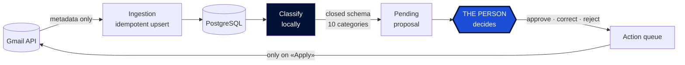
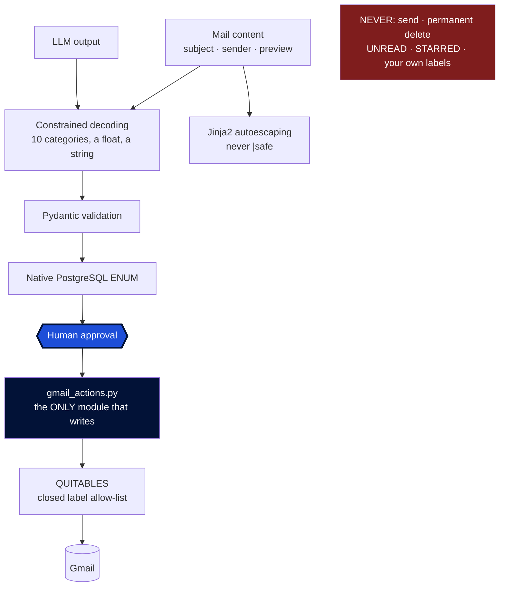

<p align="center">
  <picture>
    <source srcset="src/mailpilot/static/logo-oscuro.png" media="(prefers-color-scheme: dark)">
    
  </picture>
</p>

<p align="center">
  <a href="https://github.com/abrilespinosa/mailpilot/actions/workflows/tests.yml">
    
  </a>
  
  
  
</p>

<p align="center">
  <b>English</b> · <a href="README.es.md">Español</a>
</p>

---

# MailPilot

An intelligent management layer over Gmail. **Locally-run** AI classifies your mail and
proposes what to do with each message — and never acts on its own.

A personal learning project about backend architecture, data systems, applied AI and
security.

> **Note on language.** The README is in English; the dashboard is in Spanish. This is a
> personal tool built in its author's language, and the ten categories are Spanish all the
> way down — the database ENUM, the Gmail labels, the prompt, and every hand-labelled mail.
> Translating the interface alone would leave English buttons reading `promociones`;
> translating it properly would invalidate every measurement below.

---

## The principle, and it is not negotiable

> **The AI proposes. The person decides. MailPilot executes only what was authorised.**

- The LLM **never** acts on Gmail. Every action goes through: proposal → validation →
  **explicit human approval** → execution → audit log.
- Mail content **never leaves the machine**. All AI runs locally with
  [Ollama](https://ollama.com). No external AI API, no paid one, ever.
- The only destructive action is **move to trash**, reversible for 30 days. Permanent
  deletion needs an OAuth scope this project never requests, so that guarantee does not
  rest on our discipline: it is not forbidden, it is unavailable.
- **MailPilot cannot send mail.** *That* guarantee does rest on the code, because
  `gmail.modify` would allow it. It is held up by a closed three-value enum, a single
  module authorised to write, and a test that greps the source for `.send(`.

---

## Stack

| | |
|---|---|
| **Language** | Python 3.14 |
| **API + dashboard** | FastAPI · Jinja2 — server-rendered, no JS framework |
| **Database** | PostgreSQL 17 · SQLAlchemy 2 · Alembic |
| **AI** | Ollama · qwen3:8b · scikit-learn (own classifier) |
| **Infra** | Docker Compose · GitHub Actions |
| **Tests** | pytest · 224 tests against real PostgreSQL |

---

## How it works



**Only metadata is read** (`format=metadata`): subject, sender, preview, date and labels.
The body is never downloaded, and what is not downloaded cannot leak.

**Persistence is idempotent**: `INSERT ... ON CONFLICT` on the Gmail id. Re-ingesting a
thousand times leaves the same rows.

**Deciding and executing are separate steps.** Approved actions are queued and only change
Gmail when you press «Apply». That intermediate step is what makes a destructive action
reviewable: you see what is about to happen before it happens.

---

## Where the safety actually lives



**There is no field through which the model could request an action.** It returns one of
ten categories, a number between 0 and 1, and an explanation — and that explanation is
shown to the person but never interpreted as an instruction.

The defence against prompt injection is architectural, not phrase detection: generation is
restricted to a JSON schema **during token sampling** (not a polite request in the prompt),
anything that fails validation is discarded, the PostgreSQL ENUM is a last barrier that
holds even for writes that bypass the application, and the template autoescapes, so a mail
containing `<script>` is read but never run.

And a set of tests verify that something **does not exist**: that no module can send mail,
that only one writes to Gmail, that the removable-label list is closed, that the server
never opens a browser. They run on every push.

---

## Try it in one minute, with no Gmail account


```bash
python scripts/seed_demo.py
DATABASE_URL="$(grep -m1 '^DATABASE_URL' .env | cut -d= -f2-)_demo" uvicorn mailpilot.api:app
```

Ten invented mails, no credentials and no model download. It writes to
`<your_database>_demo`, so it cannot touch real mail.

Watch the first card. The model's reasoning is sound — *a confirmation with a date, a time
and a link to manage it* — and its answer is wrong anyway, at **0.95 confidence**. **Two
proposals are deliberately wrong**, because a demo where the AI is always right never shows
why the human step exists. One mail carries a `<script>` tag in its subject, so you can
watch the escaping work.

---

## What it cost to get an honest number

Eight prompt versions and several hand-labelled sets. The interesting part is not the final
percentage — it is how many ways there are to measure yourself wrong:

| Prompt | Set | Accuracy | |
|---|---|---|---|
| v2 | dev | 87.5 % | ⚠️ inflated: tuned on those same mails |
| v4 | test | 92.5 % | ⚠️ inflated: the prompt was written looking at its errors |
| **v4** | **test2** | **73.8 %** | **first honest measurement** |
| **v7** | **test6** | **82.5 %** | **honest, blind-labelled** |

**That 92.5 % was an 18.7-point mirage.** Tuning against the errors of the same set you
measure with inflates the result, and only a set nobody has touched reveals it.

### Three things measuring properly taught

**One ambiguous word cost 16 points.** The definition of `promociones` said "unsolicited
offers", and in Spanish *oferta* means both a discount **and** a job opening, so job-board
alerts landed in advertising. Fixing the wording took `trabajo` from 3/16 to 16/16. It was
not a model failure: it was an ambiguous specification.

**Showing the model's answer before asking changes the answer.** The same 160 mails, split
in half, same prompt, same day:

| | blind | seeing the proposal |
|---|---|---|
| overall accuracy | 82.1 % | 85.0 % |
| accuracy on the ambiguous category | 65.4 % | 87.5 % |

The effect concentrates exactly where the decision is doubtful: approving is one click and
disagreeing costs effort. That is why the dashboard has a blind mode — and why blind mode
is now **the default**. Of the two possible defaults, only one fails safely: forgetting
blind mode costs you a hint; forgetting to turn it on corrupts your data silently.

**The LLM's confidence is useless as a threshold.** Measured across two models and seven
prompts, the gap between hits and misses never exceeded +0.07. Asking the model to
calibrate itself made it worse. Design consequence: nothing is auto-approved on confidence.

### The plateau was in the categories, not the prompt

`otros` was the worst category in all four honest measurements. It meant two things at once
— "a newsletter I subscribed to" and "the model doesn't know" — and **no prompt version
fixes an ambiguous definition**: it only moves errors around.

So the fix was not another prompt. **The categories were defined by topic, and topics have
no edges.** Seven became ten, each now defined by a question with a checkable answer:

| | The question that decides |
|---|---|
| `personal` | did a person write this, to me? |
| `seguridad` | is this about accessing an account of mine? |
| `tramites` | are there consequences if I ignore it? |
| `compras` | is this about something I already bought? |
| `empleo` | is this about getting a job? |
| `boletines` | did I subscribe to this? |
| `social` | is this social-network activity? |
| `avisos` | is a service I use notifying me of something operational? |
| `promociones` | does it want to sell me something **now**? |
| `otros` | only "fits none of the above" |

A topic can be read ten ways; a fact cannot. And `otros` stopped being a junk drawer and
became a **health metric**: since it only means "fits nothing", it rising above 5 % is the
signal that a category is missing. Across 758 labelled mails it has come up **zero times**.

---

## Then I trained my own classifier

Once the categories were fixed, the errors stopped coming in groups — they were seven
different confusions, none repeated. A group can be caught with a rule; scattered errors
mean the criteria are right and the input is too thin. The LLM also re-reads all ten
definitions every time mail arrives from `goodreads.com`, while a trained model learns that
domain once.

So I trained one: **TF-IDF + logistic regression** on my own labels, measured against qwen3
on the same mails.

The model is twenty lines of scikit-learn. The measurement is the part worth reading:

- **Only labels decided blind.** Seeing the model's guess first pushes you to agree with
  it, so an anchored label teaches the new model to copy the old one's biases.
- **371 existing labels were thrown away**, because nothing recorded which were anchored.
  The database now has a `decidido_a_ciegas` column so that can never be lost again.
- **The split is frozen to a file** and the script refuses to regenerate it — redoing it
  would move mails between halves and silently invalidate every earlier number.

| | Accuracy | Time per mail |
|---|---|---|
| Always answer the most common category | 20.9 % | — |
| **Trained model** | **73.6 %** | **0.001 s** |
| qwen3:8b | 72.5 % | 6.3 s |

A tie (McNemar, z = 0.00) and **6,000 times faster**. And worth stating plainly: the 82 %
quoted above was never comparable with this, because it came from the old seven-category
taxonomy on different mails.

### The interesting part: they fail on different mail

The trained model wins where the **sender** decides the answer: `promociones` scores 0.89
F1 from 16 examples, because "stradivarius" and "fnac" are enough. qwen3 wins where the mail
has to be **understood** — `personal` ("is there a person behind this?") and `tramites`
("are there consequences if I ignore it?").

Only 9 of 91 mails defeat both. Something that always picked the right one would reach
**90.1 %**, against 73.6 % for the better one alone. That is a measured argument for a
hybrid, not a guess — and it is what
[ADR 008](docs/decisions/008-el-arbitro-cede-por-categoria.md) went on to build.

---

## What I learned most from: the numbers moved enormously

Three different test sets, each blind-labelled and looked at exactly once:

| Set | Trained model | qwen3:8b |
|---|---|---|
| generation 1 (91) | 73.6 % | 72.5 % |
| generation 2 (199) | **60.3 %** | **54.3 %** |
| generation 3 (196) | **76.5 %** | 58.7 % |

A model swinging between 60 % and 76 % depending on who you ask does not interpret itself.
**What makes those numbers readable is having qwen3 alongside**: it learns nothing, it is
the same function with the same prompt, so when it reads 72.5 and then 54.3, what changed
is not the instrument — it is the mail.

That let me split generation 3's jump into three parts: **+2.4** from a more favourable
category mix, **+5.7** because the mail itself is easier (measured by qwen3, which cannot
improve), and **~+8.1** of real model improvement.

A fixed model measuring next to one that learns is the only thing that separates "I got
worse" from "the exam got harder". It is the piece of methodology that has served me most.

**One detail I had backwards for two sessions**: labelling walks backwards in time, so the
test set is **older** than the training set, not newer. These numbers therefore measure
backwards generalisation, not future performance — and measuring the latter means holding
out mail that has not arrived yet.

*Full experiment log, including two hypotheses that turned out false:*
[`entrenamiento/README.md`](entrenamiento/README.md).

---

## Status

- [x] **Phases 1-4** — Gmail API + OAuth · idempotent ingestion · data model · API
- [x] **Phases 5-6** — Local classification with Ollama · evaluation on blind sets
- [x] **Phases 7-8** — Proposals and decisions · dashboard, blind mode by default
- [x] **Phase 9** — Real Gmail actions: label, archive, trash, restore
- [x] **Phases 10-11** — Ten categories with checkable questions · background loading
- [x] **Phase 12** — A trained classifier, measured against the LLM
- [x] **A referee** between the two models: cedes by category, not by confidence
- [ ] **Next** — auto-approving the high-confidence third of the inbox (98.6 % accurate on
      mail the model never saw) · observability · full Docker

---

## Getting started

**Requirements:** Docker, Python 3.14, [Ollama](https://ollama.com), and Gmail API OAuth
credentials.

```bash
python -m venv venv && source venv/bin/activate
pip install -e ".[dev]"       # editable: no reinstall after edits

cp .env.example .env          # then fill it in

docker compose up -d          # PostgreSQL
alembic upgrade head          # create the schema
ollama pull qwen3:8b
```

Google credentials (`credentials/client_secret.json`) come from Google Cloud Console. The
folder is excluded from the repository.

### Use

```bash
python scripts/test_auth.py            # verify OAuth
python scripts/ingest.py --limit 80    # Gmail -> PostgreSQL
python scripts/classify.py             # classify
python scripts/propose.py              # generate proposals

uvicorn mailpilot.api:app --reload
```

- `http://localhost:8000/` — **the dashboard**, in blind mode. Ten category chips per mail,
  plus a separate trash gesture, because "what is this" and "I don't want it" are two
  different questions. Add `?ciego=0` to see what the model proposed — at the cost of that
  batch no longer counting as a measurement.
- `http://localhost:8000/docs` — interactive API docs, generated from the type hints.

The dashboard **has no write endpoints of its own**: it serves HTML, and its buttons call
the same JSON API any other client would. Rules live in one place and the screen is not a
privileged path. A test walks its routes and requires every one to be `GET`.

### Tests

```bash
pytest                    # everything (needs PostgreSQL running)
pytest -m "not db"        # only the ones that skip the database
```

Real PostgreSQL, not SQLite, on purpose: the schema needs native ENUMs and JSONB. With
SQLite the tests would pass while production broke — the worst thing a test can do.

---

## Layout

```
src/mailpilot/
  auth.py           OAuth credentials (the only module touching credentials/)
  gmail.py          reading the Gmail API
  gmail_actions.py  the ONLY module that writes to Gmail
  db.py             engine and sessions
  models.py         five tables + the closed enums
  schemas.py        API schemas, deliberately separate from the DB models
  repository.py     persistence, proposals and decisions
  classifier.py     classification with Ollama
  jobs.py           the background batch behind the "load mail" button
  api.py            FastAPI: the JSON API, the only write path
  web.py            dashboard: GET routes only, HTML only
scripts/            manual tools, including the training scripts
entrenamiento/      the experiment log (the data itself is not versioned)
docs/decisions/     ADRs
```

**API schemas are kept separate from database models on purpose.** Adding a column to a
table does not publish it over HTTP: exposing a field is an explicit decision, and a test
pins the exact set of fields the listing returns.

---

## Security and privacy

- Mail content **never leaves the machine**, and **the body is never downloaded**: only
  subject, sender and preview.
- Credentials, `.env` and evaluation data are excluded from the repository, and the history
  was audited before making it public.
- PostgreSQL listens on **`127.0.0.1` only**, and the API is always started on localhost.
- Write endpoints are an **allow-list verified by a test**: any new write route fails the
  suite until it is added deliberately. **There is no `DELETE` endpoint at all.**
- An expired token returns a 503 with instructions instead of hanging the request: the
  server can never enter the interactive browser flow.

---

## Architecture decisions

In [`docs/decisions/`](docs/decisions/), each with context, rejected alternatives and
consequences.

- [**ADR 001** — Classification categories](docs/decisions/001-categorias-de-clasificacion.md)
  — why a closed enum. *Superseded by ADR 006.*
- [**ADR 002** — Trashing is not correcting](docs/decisions/002-tirar-no-es-corregir.md)
  — why "this is promociones" and "I'm throwing this away" are separate decisions. Merging
  them would have raised measured accuracy 3.3 points by deleting 42 % of the sample.
- [**ADR 003** — Raising the scope to `gmail.modify`](docs/decisions/003-scope-gmail-modify.md)
  — why the minimal scope **is** the security barrier, and which guarantee Google enforces
  versus which one only our code holds up.
- [**ADR 004** — Classifying archives](docs/decisions/004-clasificar-archiva.md)
  — removing INBOX is what archiving means in Gmail, and how the removable-label rule was
  narrowed rather than widened to allow it.
- [**ADR 005** — An installable package](docs/decisions/005-paquete-instalable.md)
  — why `src` was dropped from pytest's path: leaving it in would let the tests pass with a
  broken install.
- [**ADR 006** — Ten categories](docs/decisions/006-diez-categorias.md)
  — defining each category by a question with a checkable answer instead of a topic.
- [**ADR 007** — Training my own classifier](docs/decisions/007-entrenar-un-clasificador-propio.md)
  — why another prompt was the wrong move, and why 371 existing labels were thrown away
  rather than reused.
- [**ADR 008** — The referee cedes by category](docs/decisions/008-el-arbitro-cede-por-categoria.md)
  — the confidence threshold that looked obvious, failed, and was worth writing down anyway.

---

## License

MIT
